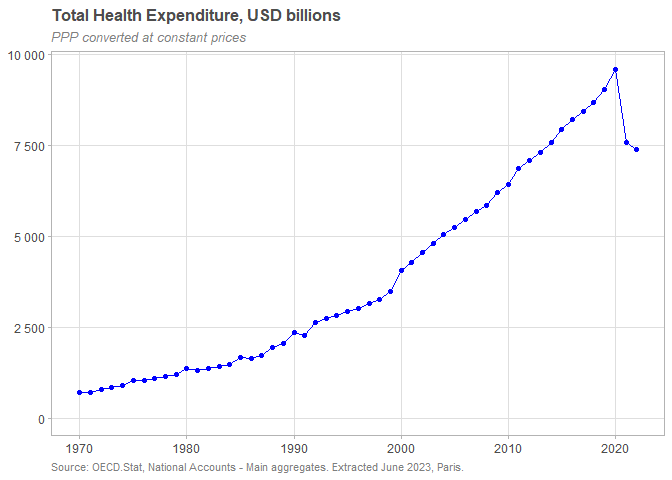
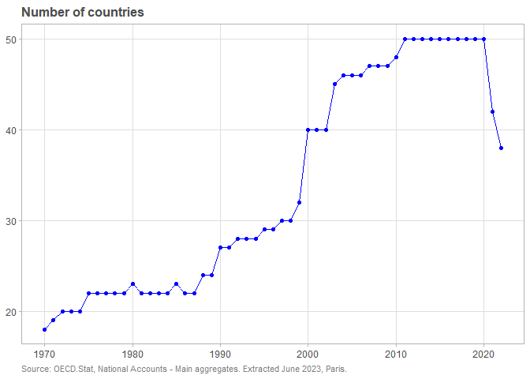

Hello World!
================
Claudia Tanaka
2024-02-17

``` r
knitr::opts_chunk$set( message=FALSE, warning=FALSE )
options(scipen=999) # "Desliga" notação científica. Para "ligar" use scipen=0


library(tidyverse) # para trabalhar com tabelas
```

    ## ── Attaching core tidyverse packages ──────────────────────── tidyverse 2.0.0 ──
    ## ✔ dplyr     1.1.4     ✔ readr     2.1.5
    ## ✔ forcats   1.0.0     ✔ stringr   1.5.1
    ## ✔ ggplot2   3.4.4     ✔ tibble    3.2.1
    ## ✔ lubridate 1.9.3     ✔ tidyr     1.3.1
    ## ✔ purrr     1.0.2     
    ## ── Conflicts ────────────────────────────────────────── tidyverse_conflicts() ──
    ## ✖ dplyr::filter() masks stats::filter()
    ## ✖ dplyr::lag()    masks stats::lag()
    ## ℹ Use the conflicted package (<http://conflicted.r-lib.org/>) to force all conflicts to become errors

``` r
library(arrow)
```

    ## 
    ## Attaching package: 'arrow'
    ## 
    ## The following object is masked from 'package:lubridate':
    ## 
    ##     duration
    ## 
    ## The following object is masked from 'package:utils':
    ## 
    ##     timestamp

``` r
library(gt)

theme_set(theme_light())
theme_update(
  panel.grid.minor = element_blank(),
  plot.title = element_text(size = 12, colour = "gray30", face = "bold"),
  plot.subtitle = element_text(face = 'italic', colour = "gray50", size = 10),
  plot.caption = element_text(colour = "gray50", hjust=0, size = 8),
  legend.title = element_blank(),
)
```

<br>

# Health expenditure

Data downloaded from [OECD Data
Explorer](https://data-explorer.oecd.org/)

Read .csv and write to .parquet

``` r
# # DATAFLOW  OECD.ELS.HD:DSD_SHA@DF_SHA(1.0)
# # Health expenditure and financing
# df.health_exp <- read_csv("_datasets/OECD.ELS.HD,DSD_SHA@DF_SHA,1.0+all.csv",name_repair="universal")
#
# df.health_exp |>
#   group_by(TIME_PERIOD) |>
#   arrow::write_dataset("_datasets/OECD_HEALTH_EXP/")
```

<br>

Read from .parquet

``` r
oecd.hlth.exp <- open_dataset("_datasets/OECD_HEALTH_EXP/") |>
  select(-c(STRUCTURE, STRUCTURE_ID, STRUCTURE_NAME, ACTION,
            Measure, MEASURE, Currency, Decimals, DECIMALS,
            FINANCING_SCHEME_REV, Revenues.of.financing.schemes,
            FACTOR_PROVISION, Factor.of.provision, Observation.value, Base.period,
            Asset.type, ASSET_TYPE, PRICE_BASE,
            Time.period,
            OBS_STATUS, OBS_STATUS2, OBS_STATUS3, Observation.status.3,
            UNIT_MULT,
            FREQ, Frequency.of.observation)) |>
  rename(iso3c=REF_AREA, country=Reference.area, ano=TIME_PERIOD,
         health_function=7) |>
  mutate(ano = as.integer(ano)) |>
  rename_with(tolower)
```

<br>

Inspect

``` r
glimpse(oecd.hlth.exp)
```

    ## FileSystemDataset with 53 Parquet files (query)
    ## 10,332,221 rows x 20 columns
    ## $ iso3c                <string> "KOR", "KOR", "CAN", "AUT", "KOR", "AUS", "KOR",…
    ## $ country              <string> "Korea", "Korea", "Canada", "Austria", "Korea", …
    ## $ unit_measure         <string> "PT_B1GQ", "PT_EXP_HLTH", "PT_EXP_PRV", "XDC", "…
    ## $ unit.of.measure      <string> "Percentage of GDP", "Percentage of expenditure …
    ## $ financing_scheme     <string> "_T", "HF2", "HF1", "HF1", "_T", "HF2HF3", "HF31…
    ## $ financing.scheme     <string> "Total", "Voluntary health care payment schemes"…
    ## $ health_function      <string> "BASIC", "HC1HC2", "HC6HC7", "_T", "HC1_HC5", "H…
    ## $ health.function      <string> "Basic health care services", "Curative and reha…
    ## $ mode_provision       <string> "_T", "_T", "_T", "_T", "_T", "_T", "_T", "_T", …
    ## $ mode.of.provision    <string> "Total", "Total", "Total", "Total", "Total", "To…
    ## $ provider             <string> "HP6", "_T", "_T", "_T", "HP3", "_T", "_T", "_T"…
    ## $ health.care.provider <string> "Providers of preventive care", "Total", "Total"…
    ## $ price.base           <string> "Not applicable", "Not applicable", "Not applica…
    ## $ obs_value            <double> 0.036, 1.073, 100.000, 3877.534, 5.078, 57.488, …
    ## $ base_per             <double> NA, NA, NA, 2015, NA, NA, NA, NA, NA, 2015, 2015…
    ## $ currency             <string> NA, NA, NA, "EUR", NA, NA, NA, NA, NA, "KRW", NA…
    ## $ observation.status   <string> NA, NA, NA, NA, NA, NA, NA, NA, NA, NA, NA, NA, …
    ## $ observation.status.2 <string> NA, NA, NA, NA, NA, NA, NA, NA, NA, NA, NA, NA, …
    ## $ unit.multiplier      <string> "Units", "Units", "Units", "Millions", "Units", …
    ## $ ano                   <int32> 1971, 1971, 1971, 1971, 1971, 1971, 1971, 1971, …
    ## Call `print()` for query details

<br>

``` r
colSums(is.na(collect(oecd.hlth.exp))) |> as.data.frame() |> rownames_to_column() |> 
  rename(coluna=1,nulos=2) |> 
  filter(nulos>0) |> arrange(desc(nulos))
```

    ##                 coluna    nulos
    ## 1 observation.status.2 10322288
    ## 2   observation.status  9559770
    ## 3             currency  7643392
    ## 4             base_per  6641670

``` r
unique(collect(oecd.hlth.exp)$price.base)
```

    ## [1] "Not applicable"  "Constant prices" "Current prices"

``` r
oecd.hlth.exp |> 
  summarise(n=n(), .by=c(unit_measure, unit.of.measure)) |> 
  arrange(unit_measure) |> 
  collect() |> 
  gt(rowname_col="stub", locale="pt") |> sub_missing() |>
  fmt_integer(n) |> 
  tab_options(
    heading.align="left", heading.title.font.size=pct(110), heading.subtitle.font.size=pct(90),
    column_labels.font.weight="bold", column_labels.font.size=pct(80),
    column_labels.text_transform="uppercase", column_labels.background.color="gray95",
    data_row.padding=px(2), row_group.padding=px(2), row_group.font.weight="bold",
    table.font.size=pct(90), source_notes.font.size = pct(70)
  )
```

<div id="slgbjuvuge" style="padding-left:0px;padding-right:0px;padding-top:10px;padding-bottom:10px;overflow-x:auto;overflow-y:auto;width:auto;height:auto;">
<style>#slgbjuvuge table {
  font-family: system-ui, 'Segoe UI', Roboto, Helvetica, Arial, sans-serif, 'Apple Color Emoji', 'Segoe UI Emoji', 'Segoe UI Symbol', 'Noto Color Emoji';
  -webkit-font-smoothing: antialiased;
  -moz-osx-font-smoothing: grayscale;
}
&#10;#slgbjuvuge thead, #slgbjuvuge tbody, #slgbjuvuge tfoot, #slgbjuvuge tr, #slgbjuvuge td, #slgbjuvuge th {
  border-style: none;
}
&#10;#slgbjuvuge p {
  margin: 0;
  padding: 0;
}
&#10;#slgbjuvuge .gt_table {
  display: table;
  border-collapse: collapse;
  line-height: normal;
  margin-left: auto;
  margin-right: auto;
  color: #333333;
  font-size: 90%;
  font-weight: normal;
  font-style: normal;
  background-color: #FFFFFF;
  width: auto;
  border-top-style: solid;
  border-top-width: 2px;
  border-top-color: #A8A8A8;
  border-right-style: none;
  border-right-width: 2px;
  border-right-color: #D3D3D3;
  border-bottom-style: solid;
  border-bottom-width: 2px;
  border-bottom-color: #A8A8A8;
  border-left-style: none;
  border-left-width: 2px;
  border-left-color: #D3D3D3;
}
&#10;#slgbjuvuge .gt_caption {
  padding-top: 4px;
  padding-bottom: 4px;
}
&#10;#slgbjuvuge .gt_title {
  color: #333333;
  font-size: 110%;
  font-weight: initial;
  padding-top: 4px;
  padding-bottom: 4px;
  padding-left: 5px;
  padding-right: 5px;
  border-bottom-color: #FFFFFF;
  border-bottom-width: 0;
}
&#10;#slgbjuvuge .gt_subtitle {
  color: #333333;
  font-size: 90%;
  font-weight: initial;
  padding-top: 3px;
  padding-bottom: 5px;
  padding-left: 5px;
  padding-right: 5px;
  border-top-color: #FFFFFF;
  border-top-width: 0;
}
&#10;#slgbjuvuge .gt_heading {
  background-color: #FFFFFF;
  text-align: left;
  border-bottom-color: #FFFFFF;
  border-left-style: none;
  border-left-width: 1px;
  border-left-color: #D3D3D3;
  border-right-style: none;
  border-right-width: 1px;
  border-right-color: #D3D3D3;
}
&#10;#slgbjuvuge .gt_bottom_border {
  border-bottom-style: solid;
  border-bottom-width: 2px;
  border-bottom-color: #D3D3D3;
}
&#10;#slgbjuvuge .gt_col_headings {
  border-top-style: solid;
  border-top-width: 2px;
  border-top-color: #D3D3D3;
  border-bottom-style: solid;
  border-bottom-width: 2px;
  border-bottom-color: #D3D3D3;
  border-left-style: none;
  border-left-width: 1px;
  border-left-color: #D3D3D3;
  border-right-style: none;
  border-right-width: 1px;
  border-right-color: #D3D3D3;
}
&#10;#slgbjuvuge .gt_col_heading {
  color: #333333;
  background-color: #F2F2F2;
  font-size: 80%;
  font-weight: bold;
  text-transform: uppercase;
  border-left-style: none;
  border-left-width: 1px;
  border-left-color: #D3D3D3;
  border-right-style: none;
  border-right-width: 1px;
  border-right-color: #D3D3D3;
  vertical-align: bottom;
  padding-top: 5px;
  padding-bottom: 6px;
  padding-left: 5px;
  padding-right: 5px;
  overflow-x: hidden;
}
&#10;#slgbjuvuge .gt_column_spanner_outer {
  color: #333333;
  background-color: #F2F2F2;
  font-size: 80%;
  font-weight: bold;
  text-transform: uppercase;
  padding-top: 0;
  padding-bottom: 0;
  padding-left: 4px;
  padding-right: 4px;
}
&#10;#slgbjuvuge .gt_column_spanner_outer:first-child {
  padding-left: 0;
}
&#10;#slgbjuvuge .gt_column_spanner_outer:last-child {
  padding-right: 0;
}
&#10;#slgbjuvuge .gt_column_spanner {
  border-bottom-style: solid;
  border-bottom-width: 2px;
  border-bottom-color: #D3D3D3;
  vertical-align: bottom;
  padding-top: 5px;
  padding-bottom: 5px;
  overflow-x: hidden;
  display: inline-block;
  width: 100%;
}
&#10;#slgbjuvuge .gt_spanner_row {
  border-bottom-style: hidden;
}
&#10;#slgbjuvuge .gt_group_heading {
  padding-top: 2px;
  padding-bottom: 2px;
  padding-left: 5px;
  padding-right: 5px;
  color: #333333;
  background-color: #FFFFFF;
  font-size: 100%;
  font-weight: bold;
  text-transform: inherit;
  border-top-style: solid;
  border-top-width: 2px;
  border-top-color: #D3D3D3;
  border-bottom-style: solid;
  border-bottom-width: 2px;
  border-bottom-color: #D3D3D3;
  border-left-style: none;
  border-left-width: 1px;
  border-left-color: #D3D3D3;
  border-right-style: none;
  border-right-width: 1px;
  border-right-color: #D3D3D3;
  vertical-align: middle;
  text-align: left;
}
&#10;#slgbjuvuge .gt_empty_group_heading {
  padding: 0.5px;
  color: #333333;
  background-color: #FFFFFF;
  font-size: 100%;
  font-weight: bold;
  border-top-style: solid;
  border-top-width: 2px;
  border-top-color: #D3D3D3;
  border-bottom-style: solid;
  border-bottom-width: 2px;
  border-bottom-color: #D3D3D3;
  vertical-align: middle;
}
&#10;#slgbjuvuge .gt_from_md > :first-child {
  margin-top: 0;
}
&#10;#slgbjuvuge .gt_from_md > :last-child {
  margin-bottom: 0;
}
&#10;#slgbjuvuge .gt_row {
  padding-top: 2px;
  padding-bottom: 2px;
  padding-left: 5px;
  padding-right: 5px;
  margin: 10px;
  border-top-style: solid;
  border-top-width: 1px;
  border-top-color: #D3D3D3;
  border-left-style: none;
  border-left-width: 1px;
  border-left-color: #D3D3D3;
  border-right-style: none;
  border-right-width: 1px;
  border-right-color: #D3D3D3;
  vertical-align: middle;
  overflow-x: hidden;
}
&#10;#slgbjuvuge .gt_stub {
  color: #333333;
  background-color: #FFFFFF;
  font-size: 100%;
  font-weight: initial;
  text-transform: inherit;
  border-right-style: solid;
  border-right-width: 2px;
  border-right-color: #D3D3D3;
  padding-left: 5px;
  padding-right: 5px;
}
&#10;#slgbjuvuge .gt_stub_row_group {
  color: #333333;
  background-color: #FFFFFF;
  font-size: 100%;
  font-weight: initial;
  text-transform: inherit;
  border-right-style: solid;
  border-right-width: 2px;
  border-right-color: #D3D3D3;
  padding-left: 5px;
  padding-right: 5px;
  vertical-align: top;
}
&#10;#slgbjuvuge .gt_row_group_first td {
  border-top-width: 2px;
}
&#10;#slgbjuvuge .gt_row_group_first th {
  border-top-width: 2px;
}
&#10;#slgbjuvuge .gt_summary_row {
  color: #333333;
  background-color: #FFFFFF;
  text-transform: inherit;
  padding-top: 8px;
  padding-bottom: 8px;
  padding-left: 5px;
  padding-right: 5px;
}
&#10;#slgbjuvuge .gt_first_summary_row {
  border-top-style: solid;
  border-top-color: #D3D3D3;
}
&#10;#slgbjuvuge .gt_first_summary_row.thick {
  border-top-width: 2px;
}
&#10;#slgbjuvuge .gt_last_summary_row {
  padding-top: 8px;
  padding-bottom: 8px;
  padding-left: 5px;
  padding-right: 5px;
  border-bottom-style: solid;
  border-bottom-width: 2px;
  border-bottom-color: #D3D3D3;
}
&#10;#slgbjuvuge .gt_grand_summary_row {
  color: #333333;
  background-color: #FFFFFF;
  text-transform: inherit;
  padding-top: 8px;
  padding-bottom: 8px;
  padding-left: 5px;
  padding-right: 5px;
}
&#10;#slgbjuvuge .gt_first_grand_summary_row {
  padding-top: 8px;
  padding-bottom: 8px;
  padding-left: 5px;
  padding-right: 5px;
  border-top-style: double;
  border-top-width: 6px;
  border-top-color: #D3D3D3;
}
&#10;#slgbjuvuge .gt_last_grand_summary_row_top {
  padding-top: 8px;
  padding-bottom: 8px;
  padding-left: 5px;
  padding-right: 5px;
  border-bottom-style: double;
  border-bottom-width: 6px;
  border-bottom-color: #D3D3D3;
}
&#10;#slgbjuvuge .gt_striped {
  background-color: rgba(128, 128, 128, 0.05);
}
&#10;#slgbjuvuge .gt_table_body {
  border-top-style: solid;
  border-top-width: 2px;
  border-top-color: #D3D3D3;
  border-bottom-style: solid;
  border-bottom-width: 2px;
  border-bottom-color: #D3D3D3;
}
&#10;#slgbjuvuge .gt_footnotes {
  color: #333333;
  background-color: #FFFFFF;
  border-bottom-style: none;
  border-bottom-width: 2px;
  border-bottom-color: #D3D3D3;
  border-left-style: none;
  border-left-width: 2px;
  border-left-color: #D3D3D3;
  border-right-style: none;
  border-right-width: 2px;
  border-right-color: #D3D3D3;
}
&#10;#slgbjuvuge .gt_footnote {
  margin: 0px;
  font-size: 90%;
  padding-top: 4px;
  padding-bottom: 4px;
  padding-left: 5px;
  padding-right: 5px;
}
&#10;#slgbjuvuge .gt_sourcenotes {
  color: #333333;
  background-color: #FFFFFF;
  border-bottom-style: none;
  border-bottom-width: 2px;
  border-bottom-color: #D3D3D3;
  border-left-style: none;
  border-left-width: 2px;
  border-left-color: #D3D3D3;
  border-right-style: none;
  border-right-width: 2px;
  border-right-color: #D3D3D3;
}
&#10;#slgbjuvuge .gt_sourcenote {
  font-size: 70%;
  padding-top: 4px;
  padding-bottom: 4px;
  padding-left: 5px;
  padding-right: 5px;
}
&#10;#slgbjuvuge .gt_left {
  text-align: left;
}
&#10;#slgbjuvuge .gt_center {
  text-align: center;
}
&#10;#slgbjuvuge .gt_right {
  text-align: right;
  font-variant-numeric: tabular-nums;
}
&#10;#slgbjuvuge .gt_font_normal {
  font-weight: normal;
}
&#10;#slgbjuvuge .gt_font_bold {
  font-weight: bold;
}
&#10;#slgbjuvuge .gt_font_italic {
  font-style: italic;
}
&#10;#slgbjuvuge .gt_super {
  font-size: 65%;
}
&#10;#slgbjuvuge .gt_footnote_marks {
  font-size: 75%;
  vertical-align: 0.4em;
  position: initial;
}
&#10;#slgbjuvuge .gt_asterisk {
  font-size: 100%;
  vertical-align: 0;
}
&#10;#slgbjuvuge .gt_indent_1 {
  text-indent: 5px;
}
&#10;#slgbjuvuge .gt_indent_2 {
  text-indent: 10px;
}
&#10;#slgbjuvuge .gt_indent_3 {
  text-indent: 15px;
}
&#10;#slgbjuvuge .gt_indent_4 {
  text-indent: 20px;
}
&#10;#slgbjuvuge .gt_indent_5 {
  text-indent: 25px;
}
</style>
<table class="gt_table" data-quarto-disable-processing="false" data-quarto-bootstrap="false">
  <thead>
    <tr class="gt_col_headings">
      <th class="gt_col_heading gt_columns_bottom_border gt_left" rowspan="1" colspan="1" scope="col" id="unit_measure">unit_measure</th>
      <th class="gt_col_heading gt_columns_bottom_border gt_left" rowspan="1" colspan="1" scope="col" id="unit.of.measure">unit.of.measure</th>
      <th class="gt_col_heading gt_columns_bottom_border gt_right" rowspan="1" colspan="1" scope="col" id="n">n</th>
    </tr>
  </thead>
  <tbody class="gt_table_body">
    <tr><td headers="unit_measure" class="gt_row gt_left">EUR_PPP</td>
<td headers="unit.of.measure" class="gt_row gt_left">Euros, PPP converted</td>
<td headers="n" class="gt_row gt_right">1.007.544</td></tr>
    <tr><td headers="unit_measure" class="gt_row gt_left">EUR_PPP_PS</td>
<td headers="unit.of.measure" class="gt_row gt_left">Euros per person, PPP converted</td>
<td headers="n" class="gt_row gt_right">1.002.475</td></tr>
    <tr><td headers="unit_measure" class="gt_row gt_left">PT_B1GQ</td>
<td headers="unit.of.measure" class="gt_row gt_left">Percentage of GDP</td>
<td headers="n" class="gt_row gt_right">616.611</td></tr>
    <tr><td headers="unit_measure" class="gt_row gt_left">PT_EXP_FNC</td>
<td headers="unit.of.measure" class="gt_row gt_left">Percentage of expenditure in the same function</td>
<td headers="n" class="gt_row gt_right">568.606</td></tr>
    <tr><td headers="unit_measure" class="gt_row gt_left">PT_EXP_FS</td>
<td headers="unit.of.measure" class="gt_row gt_left">Percentage of expenditure in the same financing scheme</td>
<td headers="n" class="gt_row gt_right">561.053</td></tr>
    <tr><td headers="unit_measure" class="gt_row gt_left">PT_EXP_HLTH</td>
<td headers="unit.of.measure" class="gt_row gt_left">Percentage of expenditure on health</td>
<td headers="n" class="gt_row gt_right">634.042</td></tr>
    <tr><td headers="unit_measure" class="gt_row gt_left">PT_EXP_PRV</td>
<td headers="unit.of.measure" class="gt_row gt_left">Percentage of expenditure in the same provider</td>
<td headers="n" class="gt_row gt_right">570.319</td></tr>
    <tr><td headers="unit_measure" class="gt_row gt_left">USD_PPP</td>
<td headers="unit.of.measure" class="gt_row gt_left">US dollars, PPP converted</td>
<td headers="n" class="gt_row gt_right">1.344.483</td></tr>
    <tr><td headers="unit_measure" class="gt_row gt_left">USD_PPP_PS</td>
<td headers="unit.of.measure" class="gt_row gt_left">US dollars per person, PPP converted</td>
<td headers="n" class="gt_row gt_right">1.338.259</td></tr>
    <tr><td headers="unit_measure" class="gt_row gt_left">XDC</td>
<td headers="unit.of.measure" class="gt_row gt_left">National currency</td>
<td headers="n" class="gt_row gt_right">1.347.114</td></tr>
    <tr><td headers="unit_measure" class="gt_row gt_left">XDC_PS</td>
<td headers="unit.of.measure" class="gt_row gt_left">National currency per person</td>
<td headers="n" class="gt_row gt_right">1.341.715</td></tr>
  </tbody>
  &#10;  
</table>
</div>

``` r
oecd.hlth.exp |> 
  summarise(n=n(), .by=c(financing_scheme, financing.scheme)) |> 
  arrange(financing_scheme) |> 
  collect() |> 
  gt(rowname_col="stub", locale="pt") |> sub_missing() |>
  fmt_integer(n) |> 
  tab_options(
    heading.align="left", heading.title.font.size=pct(110), heading.subtitle.font.size=pct(90),
    column_labels.font.weight="bold", column_labels.font.size=pct(80),
    column_labels.text_transform="uppercase", column_labels.background.color="gray95",
    data_row.padding=px(2), row_group.padding=px(2), row_group.font.weight="bold",
    table.font.size=pct(90), source_notes.font.size = pct(70)
  )
```

<div id="ygacxgxuxc" style="padding-left:0px;padding-right:0px;padding-top:10px;padding-bottom:10px;overflow-x:auto;overflow-y:auto;width:auto;height:auto;">
<style>#ygacxgxuxc table {
  font-family: system-ui, 'Segoe UI', Roboto, Helvetica, Arial, sans-serif, 'Apple Color Emoji', 'Segoe UI Emoji', 'Segoe UI Symbol', 'Noto Color Emoji';
  -webkit-font-smoothing: antialiased;
  -moz-osx-font-smoothing: grayscale;
}
&#10;#ygacxgxuxc thead, #ygacxgxuxc tbody, #ygacxgxuxc tfoot, #ygacxgxuxc tr, #ygacxgxuxc td, #ygacxgxuxc th {
  border-style: none;
}
&#10;#ygacxgxuxc p {
  margin: 0;
  padding: 0;
}
&#10;#ygacxgxuxc .gt_table {
  display: table;
  border-collapse: collapse;
  line-height: normal;
  margin-left: auto;
  margin-right: auto;
  color: #333333;
  font-size: 90%;
  font-weight: normal;
  font-style: normal;
  background-color: #FFFFFF;
  width: auto;
  border-top-style: solid;
  border-top-width: 2px;
  border-top-color: #A8A8A8;
  border-right-style: none;
  border-right-width: 2px;
  border-right-color: #D3D3D3;
  border-bottom-style: solid;
  border-bottom-width: 2px;
  border-bottom-color: #A8A8A8;
  border-left-style: none;
  border-left-width: 2px;
  border-left-color: #D3D3D3;
}
&#10;#ygacxgxuxc .gt_caption {
  padding-top: 4px;
  padding-bottom: 4px;
}
&#10;#ygacxgxuxc .gt_title {
  color: #333333;
  font-size: 110%;
  font-weight: initial;
  padding-top: 4px;
  padding-bottom: 4px;
  padding-left: 5px;
  padding-right: 5px;
  border-bottom-color: #FFFFFF;
  border-bottom-width: 0;
}
&#10;#ygacxgxuxc .gt_subtitle {
  color: #333333;
  font-size: 90%;
  font-weight: initial;
  padding-top: 3px;
  padding-bottom: 5px;
  padding-left: 5px;
  padding-right: 5px;
  border-top-color: #FFFFFF;
  border-top-width: 0;
}
&#10;#ygacxgxuxc .gt_heading {
  background-color: #FFFFFF;
  text-align: left;
  border-bottom-color: #FFFFFF;
  border-left-style: none;
  border-left-width: 1px;
  border-left-color: #D3D3D3;
  border-right-style: none;
  border-right-width: 1px;
  border-right-color: #D3D3D3;
}
&#10;#ygacxgxuxc .gt_bottom_border {
  border-bottom-style: solid;
  border-bottom-width: 2px;
  border-bottom-color: #D3D3D3;
}
&#10;#ygacxgxuxc .gt_col_headings {
  border-top-style: solid;
  border-top-width: 2px;
  border-top-color: #D3D3D3;
  border-bottom-style: solid;
  border-bottom-width: 2px;
  border-bottom-color: #D3D3D3;
  border-left-style: none;
  border-left-width: 1px;
  border-left-color: #D3D3D3;
  border-right-style: none;
  border-right-width: 1px;
  border-right-color: #D3D3D3;
}
&#10;#ygacxgxuxc .gt_col_heading {
  color: #333333;
  background-color: #F2F2F2;
  font-size: 80%;
  font-weight: bold;
  text-transform: uppercase;
  border-left-style: none;
  border-left-width: 1px;
  border-left-color: #D3D3D3;
  border-right-style: none;
  border-right-width: 1px;
  border-right-color: #D3D3D3;
  vertical-align: bottom;
  padding-top: 5px;
  padding-bottom: 6px;
  padding-left: 5px;
  padding-right: 5px;
  overflow-x: hidden;
}
&#10;#ygacxgxuxc .gt_column_spanner_outer {
  color: #333333;
  background-color: #F2F2F2;
  font-size: 80%;
  font-weight: bold;
  text-transform: uppercase;
  padding-top: 0;
  padding-bottom: 0;
  padding-left: 4px;
  padding-right: 4px;
}
&#10;#ygacxgxuxc .gt_column_spanner_outer:first-child {
  padding-left: 0;
}
&#10;#ygacxgxuxc .gt_column_spanner_outer:last-child {
  padding-right: 0;
}
&#10;#ygacxgxuxc .gt_column_spanner {
  border-bottom-style: solid;
  border-bottom-width: 2px;
  border-bottom-color: #D3D3D3;
  vertical-align: bottom;
  padding-top: 5px;
  padding-bottom: 5px;
  overflow-x: hidden;
  display: inline-block;
  width: 100%;
}
&#10;#ygacxgxuxc .gt_spanner_row {
  border-bottom-style: hidden;
}
&#10;#ygacxgxuxc .gt_group_heading {
  padding-top: 2px;
  padding-bottom: 2px;
  padding-left: 5px;
  padding-right: 5px;
  color: #333333;
  background-color: #FFFFFF;
  font-size: 100%;
  font-weight: bold;
  text-transform: inherit;
  border-top-style: solid;
  border-top-width: 2px;
  border-top-color: #D3D3D3;
  border-bottom-style: solid;
  border-bottom-width: 2px;
  border-bottom-color: #D3D3D3;
  border-left-style: none;
  border-left-width: 1px;
  border-left-color: #D3D3D3;
  border-right-style: none;
  border-right-width: 1px;
  border-right-color: #D3D3D3;
  vertical-align: middle;
  text-align: left;
}
&#10;#ygacxgxuxc .gt_empty_group_heading {
  padding: 0.5px;
  color: #333333;
  background-color: #FFFFFF;
  font-size: 100%;
  font-weight: bold;
  border-top-style: solid;
  border-top-width: 2px;
  border-top-color: #D3D3D3;
  border-bottom-style: solid;
  border-bottom-width: 2px;
  border-bottom-color: #D3D3D3;
  vertical-align: middle;
}
&#10;#ygacxgxuxc .gt_from_md > :first-child {
  margin-top: 0;
}
&#10;#ygacxgxuxc .gt_from_md > :last-child {
  margin-bottom: 0;
}
&#10;#ygacxgxuxc .gt_row {
  padding-top: 2px;
  padding-bottom: 2px;
  padding-left: 5px;
  padding-right: 5px;
  margin: 10px;
  border-top-style: solid;
  border-top-width: 1px;
  border-top-color: #D3D3D3;
  border-left-style: none;
  border-left-width: 1px;
  border-left-color: #D3D3D3;
  border-right-style: none;
  border-right-width: 1px;
  border-right-color: #D3D3D3;
  vertical-align: middle;
  overflow-x: hidden;
}
&#10;#ygacxgxuxc .gt_stub {
  color: #333333;
  background-color: #FFFFFF;
  font-size: 100%;
  font-weight: initial;
  text-transform: inherit;
  border-right-style: solid;
  border-right-width: 2px;
  border-right-color: #D3D3D3;
  padding-left: 5px;
  padding-right: 5px;
}
&#10;#ygacxgxuxc .gt_stub_row_group {
  color: #333333;
  background-color: #FFFFFF;
  font-size: 100%;
  font-weight: initial;
  text-transform: inherit;
  border-right-style: solid;
  border-right-width: 2px;
  border-right-color: #D3D3D3;
  padding-left: 5px;
  padding-right: 5px;
  vertical-align: top;
}
&#10;#ygacxgxuxc .gt_row_group_first td {
  border-top-width: 2px;
}
&#10;#ygacxgxuxc .gt_row_group_first th {
  border-top-width: 2px;
}
&#10;#ygacxgxuxc .gt_summary_row {
  color: #333333;
  background-color: #FFFFFF;
  text-transform: inherit;
  padding-top: 8px;
  padding-bottom: 8px;
  padding-left: 5px;
  padding-right: 5px;
}
&#10;#ygacxgxuxc .gt_first_summary_row {
  border-top-style: solid;
  border-top-color: #D3D3D3;
}
&#10;#ygacxgxuxc .gt_first_summary_row.thick {
  border-top-width: 2px;
}
&#10;#ygacxgxuxc .gt_last_summary_row {
  padding-top: 8px;
  padding-bottom: 8px;
  padding-left: 5px;
  padding-right: 5px;
  border-bottom-style: solid;
  border-bottom-width: 2px;
  border-bottom-color: #D3D3D3;
}
&#10;#ygacxgxuxc .gt_grand_summary_row {
  color: #333333;
  background-color: #FFFFFF;
  text-transform: inherit;
  padding-top: 8px;
  padding-bottom: 8px;
  padding-left: 5px;
  padding-right: 5px;
}
&#10;#ygacxgxuxc .gt_first_grand_summary_row {
  padding-top: 8px;
  padding-bottom: 8px;
  padding-left: 5px;
  padding-right: 5px;
  border-top-style: double;
  border-top-width: 6px;
  border-top-color: #D3D3D3;
}
&#10;#ygacxgxuxc .gt_last_grand_summary_row_top {
  padding-top: 8px;
  padding-bottom: 8px;
  padding-left: 5px;
  padding-right: 5px;
  border-bottom-style: double;
  border-bottom-width: 6px;
  border-bottom-color: #D3D3D3;
}
&#10;#ygacxgxuxc .gt_striped {
  background-color: rgba(128, 128, 128, 0.05);
}
&#10;#ygacxgxuxc .gt_table_body {
  border-top-style: solid;
  border-top-width: 2px;
  border-top-color: #D3D3D3;
  border-bottom-style: solid;
  border-bottom-width: 2px;
  border-bottom-color: #D3D3D3;
}
&#10;#ygacxgxuxc .gt_footnotes {
  color: #333333;
  background-color: #FFFFFF;
  border-bottom-style: none;
  border-bottom-width: 2px;
  border-bottom-color: #D3D3D3;
  border-left-style: none;
  border-left-width: 2px;
  border-left-color: #D3D3D3;
  border-right-style: none;
  border-right-width: 2px;
  border-right-color: #D3D3D3;
}
&#10;#ygacxgxuxc .gt_footnote {
  margin: 0px;
  font-size: 90%;
  padding-top: 4px;
  padding-bottom: 4px;
  padding-left: 5px;
  padding-right: 5px;
}
&#10;#ygacxgxuxc .gt_sourcenotes {
  color: #333333;
  background-color: #FFFFFF;
  border-bottom-style: none;
  border-bottom-width: 2px;
  border-bottom-color: #D3D3D3;
  border-left-style: none;
  border-left-width: 2px;
  border-left-color: #D3D3D3;
  border-right-style: none;
  border-right-width: 2px;
  border-right-color: #D3D3D3;
}
&#10;#ygacxgxuxc .gt_sourcenote {
  font-size: 70%;
  padding-top: 4px;
  padding-bottom: 4px;
  padding-left: 5px;
  padding-right: 5px;
}
&#10;#ygacxgxuxc .gt_left {
  text-align: left;
}
&#10;#ygacxgxuxc .gt_center {
  text-align: center;
}
&#10;#ygacxgxuxc .gt_right {
  text-align: right;
  font-variant-numeric: tabular-nums;
}
&#10;#ygacxgxuxc .gt_font_normal {
  font-weight: normal;
}
&#10;#ygacxgxuxc .gt_font_bold {
  font-weight: bold;
}
&#10;#ygacxgxuxc .gt_font_italic {
  font-style: italic;
}
&#10;#ygacxgxuxc .gt_super {
  font-size: 65%;
}
&#10;#ygacxgxuxc .gt_footnote_marks {
  font-size: 75%;
  vertical-align: 0.4em;
  position: initial;
}
&#10;#ygacxgxuxc .gt_asterisk {
  font-size: 100%;
  vertical-align: 0;
}
&#10;#ygacxgxuxc .gt_indent_1 {
  text-indent: 5px;
}
&#10;#ygacxgxuxc .gt_indent_2 {
  text-indent: 10px;
}
&#10;#ygacxgxuxc .gt_indent_3 {
  text-indent: 15px;
}
&#10;#ygacxgxuxc .gt_indent_4 {
  text-indent: 20px;
}
&#10;#ygacxgxuxc .gt_indent_5 {
  text-indent: 25px;
}
</style>
<table class="gt_table" data-quarto-disable-processing="false" data-quarto-bootstrap="false">
  <thead>
    <tr class="gt_col_headings">
      <th class="gt_col_heading gt_columns_bottom_border gt_left" rowspan="1" colspan="1" scope="col" id="financing_scheme">financing_scheme</th>
      <th class="gt_col_heading gt_columns_bottom_border gt_left" rowspan="1" colspan="1" scope="col" id="financing.scheme">financing.scheme</th>
      <th class="gt_col_heading gt_columns_bottom_border gt_right" rowspan="1" colspan="1" scope="col" id="n">n</th>
    </tr>
  </thead>
  <tbody class="gt_table_body">
    <tr><td headers="financing_scheme" class="gt_row gt_left">HF1</td>
<td headers="financing.scheme" class="gt_row gt_left">Government/compulsory schemes</td>
<td headers="n" class="gt_row gt_right">904.236</td></tr>
    <tr><td headers="financing_scheme" class="gt_row gt_left">HF11</td>
<td headers="financing.scheme" class="gt_row gt_left">Government schemes</td>
<td headers="n" class="gt_row gt_right">707.080</td></tr>
    <tr><td headers="financing_scheme" class="gt_row gt_left">HF121</td>
<td headers="financing.scheme" class="gt_row gt_left">Social health insurance schemes</td>
<td headers="n" class="gt_row gt_right">433.106</td></tr>
    <tr><td headers="financing_scheme" class="gt_row gt_left">HF122</td>
<td headers="financing.scheme" class="gt_row gt_left">Compulsory private insurance schemes</td>
<td headers="n" class="gt_row gt_right">117.949</td></tr>
    <tr><td headers="financing_scheme" class="gt_row gt_left">HF12HF13</td>
<td headers="financing.scheme" class="gt_row gt_left">Compulsory contributory health insurance schemes</td>
<td headers="n" class="gt_row gt_right">559.223</td></tr>
    <tr><td headers="financing_scheme" class="gt_row gt_left">HF2</td>
<td headers="financing.scheme" class="gt_row gt_left">Voluntary health care payment schemes</td>
<td headers="n" class="gt_row gt_right">571.368</td></tr>
    <tr><td headers="financing_scheme" class="gt_row gt_left">HF21</td>
<td headers="financing.scheme" class="gt_row gt_left">Voluntary health insurance schemes</td>
<td headers="n" class="gt_row gt_right">439.794</td></tr>
    <tr><td headers="financing_scheme" class="gt_row gt_left">HF22</td>
<td headers="financing.scheme" class="gt_row gt_left">NPISH financing schemes</td>
<td headers="n" class="gt_row gt_right">248.628</td></tr>
    <tr><td headers="financing_scheme" class="gt_row gt_left">HF23</td>
<td headers="financing.scheme" class="gt_row gt_left">Enterprise financing schemes</td>
<td headers="n" class="gt_row gt_right">171.609</td></tr>
    <tr><td headers="financing_scheme" class="gt_row gt_left">HF2HF3</td>
<td headers="financing.scheme" class="gt_row gt_left">Voluntary schemes/household out-of-pocket payments</td>
<td headers="n" class="gt_row gt_right">764.271</td></tr>
    <tr><td headers="financing_scheme" class="gt_row gt_left">HF3</td>
<td headers="financing.scheme" class="gt_row gt_left">Household out-of-pocket payments</td>
<td headers="n" class="gt_row gt_right">606.934</td></tr>
    <tr><td headers="financing_scheme" class="gt_row gt_left">HF31</td>
<td headers="financing.scheme" class="gt_row gt_left">Out-of-pocket excluding cost-sharing</td>
<td headers="n" class="gt_row gt_right">219.342</td></tr>
    <tr><td headers="financing_scheme" class="gt_row gt_left">HF32</td>
<td headers="financing.scheme" class="gt_row gt_left">Cost-sharing with third-party payers</td>
<td headers="n" class="gt_row gt_right">165.827</td></tr>
    <tr><td headers="financing_scheme" class="gt_row gt_left">HF4</td>
<td headers="financing.scheme" class="gt_row gt_left">Rest of the world financing schemes (non-resident)</td>
<td headers="n" class="gt_row gt_right">32.154</td></tr>
    <tr><td headers="financing_scheme" class="gt_row gt_left">_T</td>
<td headers="financing.scheme" class="gt_row gt_left">Total</td>
<td headers="n" class="gt_row gt_right">4.385.749</td></tr>
    <tr><td headers="financing_scheme" class="gt_row gt_left">_U</td>
<td headers="financing.scheme" class="gt_row gt_left">Unknown</td>
<td headers="n" class="gt_row gt_right">4.951</td></tr>
  </tbody>
  &#10;  
</table>
</div>

``` r
oecd.hlth.exp |> 
  summarise(n=n(), .by=c(health_function, health.function)) |> 
  arrange(health_function) |> 
  collect() |> 
  gt(rowname_col="stub", locale="pt") |> sub_missing() |>
  fmt_integer(n) |> 
  tab_options(
    heading.align="left", heading.title.font.size=pct(110), heading.subtitle.font.size=pct(90),
    column_labels.font.weight="bold", column_labels.font.size=pct(80),
    column_labels.text_transform="uppercase", column_labels.background.color="gray95",
    data_row.padding=px(2), row_group.padding=px(2), row_group.font.weight="bold",
    table.font.size=pct(90), source_notes.font.size = pct(70)
  )
```

<div id="gvprdtttmh" style="padding-left:0px;padding-right:0px;padding-top:10px;padding-bottom:10px;overflow-x:auto;overflow-y:auto;width:auto;height:auto;">
<style>#gvprdtttmh table {
  font-family: system-ui, 'Segoe UI', Roboto, Helvetica, Arial, sans-serif, 'Apple Color Emoji', 'Segoe UI Emoji', 'Segoe UI Symbol', 'Noto Color Emoji';
  -webkit-font-smoothing: antialiased;
  -moz-osx-font-smoothing: grayscale;
}
&#10;#gvprdtttmh thead, #gvprdtttmh tbody, #gvprdtttmh tfoot, #gvprdtttmh tr, #gvprdtttmh td, #gvprdtttmh th {
  border-style: none;
}
&#10;#gvprdtttmh p {
  margin: 0;
  padding: 0;
}
&#10;#gvprdtttmh .gt_table {
  display: table;
  border-collapse: collapse;
  line-height: normal;
  margin-left: auto;
  margin-right: auto;
  color: #333333;
  font-size: 90%;
  font-weight: normal;
  font-style: normal;
  background-color: #FFFFFF;
  width: auto;
  border-top-style: solid;
  border-top-width: 2px;
  border-top-color: #A8A8A8;
  border-right-style: none;
  border-right-width: 2px;
  border-right-color: #D3D3D3;
  border-bottom-style: solid;
  border-bottom-width: 2px;
  border-bottom-color: #A8A8A8;
  border-left-style: none;
  border-left-width: 2px;
  border-left-color: #D3D3D3;
}
&#10;#gvprdtttmh .gt_caption {
  padding-top: 4px;
  padding-bottom: 4px;
}
&#10;#gvprdtttmh .gt_title {
  color: #333333;
  font-size: 110%;
  font-weight: initial;
  padding-top: 4px;
  padding-bottom: 4px;
  padding-left: 5px;
  padding-right: 5px;
  border-bottom-color: #FFFFFF;
  border-bottom-width: 0;
}
&#10;#gvprdtttmh .gt_subtitle {
  color: #333333;
  font-size: 90%;
  font-weight: initial;
  padding-top: 3px;
  padding-bottom: 5px;
  padding-left: 5px;
  padding-right: 5px;
  border-top-color: #FFFFFF;
  border-top-width: 0;
}
&#10;#gvprdtttmh .gt_heading {
  background-color: #FFFFFF;
  text-align: left;
  border-bottom-color: #FFFFFF;
  border-left-style: none;
  border-left-width: 1px;
  border-left-color: #D3D3D3;
  border-right-style: none;
  border-right-width: 1px;
  border-right-color: #D3D3D3;
}
&#10;#gvprdtttmh .gt_bottom_border {
  border-bottom-style: solid;
  border-bottom-width: 2px;
  border-bottom-color: #D3D3D3;
}
&#10;#gvprdtttmh .gt_col_headings {
  border-top-style: solid;
  border-top-width: 2px;
  border-top-color: #D3D3D3;
  border-bottom-style: solid;
  border-bottom-width: 2px;
  border-bottom-color: #D3D3D3;
  border-left-style: none;
  border-left-width: 1px;
  border-left-color: #D3D3D3;
  border-right-style: none;
  border-right-width: 1px;
  border-right-color: #D3D3D3;
}
&#10;#gvprdtttmh .gt_col_heading {
  color: #333333;
  background-color: #F2F2F2;
  font-size: 80%;
  font-weight: bold;
  text-transform: uppercase;
  border-left-style: none;
  border-left-width: 1px;
  border-left-color: #D3D3D3;
  border-right-style: none;
  border-right-width: 1px;
  border-right-color: #D3D3D3;
  vertical-align: bottom;
  padding-top: 5px;
  padding-bottom: 6px;
  padding-left: 5px;
  padding-right: 5px;
  overflow-x: hidden;
}
&#10;#gvprdtttmh .gt_column_spanner_outer {
  color: #333333;
  background-color: #F2F2F2;
  font-size: 80%;
  font-weight: bold;
  text-transform: uppercase;
  padding-top: 0;
  padding-bottom: 0;
  padding-left: 4px;
  padding-right: 4px;
}
&#10;#gvprdtttmh .gt_column_spanner_outer:first-child {
  padding-left: 0;
}
&#10;#gvprdtttmh .gt_column_spanner_outer:last-child {
  padding-right: 0;
}
&#10;#gvprdtttmh .gt_column_spanner {
  border-bottom-style: solid;
  border-bottom-width: 2px;
  border-bottom-color: #D3D3D3;
  vertical-align: bottom;
  padding-top: 5px;
  padding-bottom: 5px;
  overflow-x: hidden;
  display: inline-block;
  width: 100%;
}
&#10;#gvprdtttmh .gt_spanner_row {
  border-bottom-style: hidden;
}
&#10;#gvprdtttmh .gt_group_heading {
  padding-top: 2px;
  padding-bottom: 2px;
  padding-left: 5px;
  padding-right: 5px;
  color: #333333;
  background-color: #FFFFFF;
  font-size: 100%;
  font-weight: bold;
  text-transform: inherit;
  border-top-style: solid;
  border-top-width: 2px;
  border-top-color: #D3D3D3;
  border-bottom-style: solid;
  border-bottom-width: 2px;
  border-bottom-color: #D3D3D3;
  border-left-style: none;
  border-left-width: 1px;
  border-left-color: #D3D3D3;
  border-right-style: none;
  border-right-width: 1px;
  border-right-color: #D3D3D3;
  vertical-align: middle;
  text-align: left;
}
&#10;#gvprdtttmh .gt_empty_group_heading {
  padding: 0.5px;
  color: #333333;
  background-color: #FFFFFF;
  font-size: 100%;
  font-weight: bold;
  border-top-style: solid;
  border-top-width: 2px;
  border-top-color: #D3D3D3;
  border-bottom-style: solid;
  border-bottom-width: 2px;
  border-bottom-color: #D3D3D3;
  vertical-align: middle;
}
&#10;#gvprdtttmh .gt_from_md > :first-child {
  margin-top: 0;
}
&#10;#gvprdtttmh .gt_from_md > :last-child {
  margin-bottom: 0;
}
&#10;#gvprdtttmh .gt_row {
  padding-top: 2px;
  padding-bottom: 2px;
  padding-left: 5px;
  padding-right: 5px;
  margin: 10px;
  border-top-style: solid;
  border-top-width: 1px;
  border-top-color: #D3D3D3;
  border-left-style: none;
  border-left-width: 1px;
  border-left-color: #D3D3D3;
  border-right-style: none;
  border-right-width: 1px;
  border-right-color: #D3D3D3;
  vertical-align: middle;
  overflow-x: hidden;
}
&#10;#gvprdtttmh .gt_stub {
  color: #333333;
  background-color: #FFFFFF;
  font-size: 100%;
  font-weight: initial;
  text-transform: inherit;
  border-right-style: solid;
  border-right-width: 2px;
  border-right-color: #D3D3D3;
  padding-left: 5px;
  padding-right: 5px;
}
&#10;#gvprdtttmh .gt_stub_row_group {
  color: #333333;
  background-color: #FFFFFF;
  font-size: 100%;
  font-weight: initial;
  text-transform: inherit;
  border-right-style: solid;
  border-right-width: 2px;
  border-right-color: #D3D3D3;
  padding-left: 5px;
  padding-right: 5px;
  vertical-align: top;
}
&#10;#gvprdtttmh .gt_row_group_first td {
  border-top-width: 2px;
}
&#10;#gvprdtttmh .gt_row_group_first th {
  border-top-width: 2px;
}
&#10;#gvprdtttmh .gt_summary_row {
  color: #333333;
  background-color: #FFFFFF;
  text-transform: inherit;
  padding-top: 8px;
  padding-bottom: 8px;
  padding-left: 5px;
  padding-right: 5px;
}
&#10;#gvprdtttmh .gt_first_summary_row {
  border-top-style: solid;
  border-top-color: #D3D3D3;
}
&#10;#gvprdtttmh .gt_first_summary_row.thick {
  border-top-width: 2px;
}
&#10;#gvprdtttmh .gt_last_summary_row {
  padding-top: 8px;
  padding-bottom: 8px;
  padding-left: 5px;
  padding-right: 5px;
  border-bottom-style: solid;
  border-bottom-width: 2px;
  border-bottom-color: #D3D3D3;
}
&#10;#gvprdtttmh .gt_grand_summary_row {
  color: #333333;
  background-color: #FFFFFF;
  text-transform: inherit;
  padding-top: 8px;
  padding-bottom: 8px;
  padding-left: 5px;
  padding-right: 5px;
}
&#10;#gvprdtttmh .gt_first_grand_summary_row {
  padding-top: 8px;
  padding-bottom: 8px;
  padding-left: 5px;
  padding-right: 5px;
  border-top-style: double;
  border-top-width: 6px;
  border-top-color: #D3D3D3;
}
&#10;#gvprdtttmh .gt_last_grand_summary_row_top {
  padding-top: 8px;
  padding-bottom: 8px;
  padding-left: 5px;
  padding-right: 5px;
  border-bottom-style: double;
  border-bottom-width: 6px;
  border-bottom-color: #D3D3D3;
}
&#10;#gvprdtttmh .gt_striped {
  background-color: rgba(128, 128, 128, 0.05);
}
&#10;#gvprdtttmh .gt_table_body {
  border-top-style: solid;
  border-top-width: 2px;
  border-top-color: #D3D3D3;
  border-bottom-style: solid;
  border-bottom-width: 2px;
  border-bottom-color: #D3D3D3;
}
&#10;#gvprdtttmh .gt_footnotes {
  color: #333333;
  background-color: #FFFFFF;
  border-bottom-style: none;
  border-bottom-width: 2px;
  border-bottom-color: #D3D3D3;
  border-left-style: none;
  border-left-width: 2px;
  border-left-color: #D3D3D3;
  border-right-style: none;
  border-right-width: 2px;
  border-right-color: #D3D3D3;
}
&#10;#gvprdtttmh .gt_footnote {
  margin: 0px;
  font-size: 90%;
  padding-top: 4px;
  padding-bottom: 4px;
  padding-left: 5px;
  padding-right: 5px;
}
&#10;#gvprdtttmh .gt_sourcenotes {
  color: #333333;
  background-color: #FFFFFF;
  border-bottom-style: none;
  border-bottom-width: 2px;
  border-bottom-color: #D3D3D3;
  border-left-style: none;
  border-left-width: 2px;
  border-left-color: #D3D3D3;
  border-right-style: none;
  border-right-width: 2px;
  border-right-color: #D3D3D3;
}
&#10;#gvprdtttmh .gt_sourcenote {
  font-size: 70%;
  padding-top: 4px;
  padding-bottom: 4px;
  padding-left: 5px;
  padding-right: 5px;
}
&#10;#gvprdtttmh .gt_left {
  text-align: left;
}
&#10;#gvprdtttmh .gt_center {
  text-align: center;
}
&#10;#gvprdtttmh .gt_right {
  text-align: right;
  font-variant-numeric: tabular-nums;
}
&#10;#gvprdtttmh .gt_font_normal {
  font-weight: normal;
}
&#10;#gvprdtttmh .gt_font_bold {
  font-weight: bold;
}
&#10;#gvprdtttmh .gt_font_italic {
  font-style: italic;
}
&#10;#gvprdtttmh .gt_super {
  font-size: 65%;
}
&#10;#gvprdtttmh .gt_footnote_marks {
  font-size: 75%;
  vertical-align: 0.4em;
  position: initial;
}
&#10;#gvprdtttmh .gt_asterisk {
  font-size: 100%;
  vertical-align: 0;
}
&#10;#gvprdtttmh .gt_indent_1 {
  text-indent: 5px;
}
&#10;#gvprdtttmh .gt_indent_2 {
  text-indent: 10px;
}
&#10;#gvprdtttmh .gt_indent_3 {
  text-indent: 15px;
}
&#10;#gvprdtttmh .gt_indent_4 {
  text-indent: 20px;
}
&#10;#gvprdtttmh .gt_indent_5 {
  text-indent: 25px;
}
</style>
<table class="gt_table" data-quarto-disable-processing="false" data-quarto-bootstrap="false">
  <thead>
    <tr class="gt_col_headings">
      <th class="gt_col_heading gt_columns_bottom_border gt_left" rowspan="1" colspan="1" scope="col" id="health_function">health_function</th>
      <th class="gt_col_heading gt_columns_bottom_border gt_left" rowspan="1" colspan="1" scope="col" id="health.function">health.function</th>
      <th class="gt_col_heading gt_columns_bottom_border gt_right" rowspan="1" colspan="1" scope="col" id="n">n</th>
    </tr>
  </thead>
  <tbody class="gt_table_body">
    <tr><td headers="health_function" class="gt_row gt_left">BASIC</td>
<td headers="health.function" class="gt_row gt_left">Basic health care services</td>
<td headers="n" class="gt_row gt_right">194.064</td></tr>
    <tr><td headers="health_function" class="gt_row gt_left">BASIC_PH</td>
<td headers="health.function" class="gt_row gt_left">Basic health care services and pharmaceuticals</td>
<td headers="n" class="gt_row gt_right">157.540</td></tr>
    <tr><td headers="health_function" class="gt_row gt_left">HC0</td>
<td headers="health.function" class="gt_row gt_left">Other health care services unknown</td>
<td headers="n" class="gt_row gt_right">56.978</td></tr>
    <tr><td headers="health_function" class="gt_row gt_left">HC1</td>
<td headers="health.function" class="gt_row gt_left">Curative care</td>
<td headers="n" class="gt_row gt_right">871.726</td></tr>
    <tr><td headers="health_function" class="gt_row gt_left">HC131</td>
<td headers="health.function" class="gt_row gt_left">General curative care</td>
<td headers="n" class="gt_row gt_right">175.062</td></tr>
    <tr><td headers="health_function" class="gt_row gt_left">HC132</td>
<td headers="health.function" class="gt_row gt_left">Dental curative care</td>
<td headers="n" class="gt_row gt_right">164.315</td></tr>
    <tr><td headers="health_function" class="gt_row gt_left">HC133</td>
<td headers="health.function" class="gt_row gt_left">Specialised curative care</td>
<td headers="n" class="gt_row gt_right">146.060</td></tr>
    <tr><td headers="health_function" class="gt_row gt_left">HC139</td>
<td headers="health.function" class="gt_row gt_left">Other curative care</td>
<td headers="n" class="gt_row gt_right">105.292</td></tr>
    <tr><td headers="health_function" class="gt_row gt_left">HC1HC2</td>
<td headers="health.function" class="gt_row gt_left">Curative and rehabilitative care</td>
<td headers="n" class="gt_row gt_right">1.023.803</td></tr>
    <tr><td headers="health_function" class="gt_row gt_left">HC1_HC4</td>
<td headers="health.function" class="gt_row gt_left">Individual health care services</td>
<td headers="n" class="gt_row gt_right">361.939</td></tr>
    <tr><td headers="health_function" class="gt_row gt_left">HC1_HC5</td>
<td headers="health.function" class="gt_row gt_left">Individual health care services and medical goods</td>
<td headers="n" class="gt_row gt_right">401.381</td></tr>
    <tr><td headers="health_function" class="gt_row gt_left">HC2</td>
<td headers="health.function" class="gt_row gt_left">Rehabilitative care</td>
<td headers="n" class="gt_row gt_right">516.180</td></tr>
    <tr><td headers="health_function" class="gt_row gt_left">HC3</td>
<td headers="health.function" class="gt_row gt_left">Long-term care (health)</td>
<td headers="n" class="gt_row gt_right">642.123</td></tr>
    <tr><td headers="health_function" class="gt_row gt_left">HC4</td>
<td headers="health.function" class="gt_row gt_left">Ancillary services (non-specified by function)</td>
<td headers="n" class="gt_row gt_right">209.686</td></tr>
    <tr><td headers="health_function" class="gt_row gt_left">HC41</td>
<td headers="health.function" class="gt_row gt_left">Laboratory services</td>
<td headers="n" class="gt_row gt_right">132.729</td></tr>
    <tr><td headers="health_function" class="gt_row gt_left">HC42</td>
<td headers="health.function" class="gt_row gt_left">Imaging services</td>
<td headers="n" class="gt_row gt_right">121.699</td></tr>
    <tr><td headers="health_function" class="gt_row gt_left">HC43</td>
<td headers="health.function" class="gt_row gt_left">Patient transportation</td>
<td headers="n" class="gt_row gt_right">142.145</td></tr>
    <tr><td headers="health_function" class="gt_row gt_left">HC5</td>
<td headers="health.function" class="gt_row gt_left">Medical goods (non-specified by function)</td>
<td headers="n" class="gt_row gt_right">219.528</td></tr>
    <tr><td headers="health_function" class="gt_row gt_left">HC51</td>
<td headers="health.function" class="gt_row gt_left">Pharmaceuticals and other medical non-durable goods</td>
<td headers="n" class="gt_row gt_right">198.304</td></tr>
    <tr><td headers="health_function" class="gt_row gt_left">HC511</td>
<td headers="health.function" class="gt_row gt_left">Prescribed medicines</td>
<td headers="n" class="gt_row gt_right">133.696</td></tr>
    <tr><td headers="health_function" class="gt_row gt_left">HC512</td>
<td headers="health.function" class="gt_row gt_left">Over-the-counter medicines</td>
<td headers="n" class="gt_row gt_right">70.341</td></tr>
    <tr><td headers="health_function" class="gt_row gt_left">HC513</td>
<td headers="health.function" class="gt_row gt_left">Other medical non-durable goods</td>
<td headers="n" class="gt_row gt_right">94.145</td></tr>
    <tr><td headers="health_function" class="gt_row gt_left">HC52</td>
<td headers="health.function" class="gt_row gt_left">Therapeutic appliances and other medical durable goods</td>
<td headers="n" class="gt_row gt_right">169.602</td></tr>
    <tr><td headers="health_function" class="gt_row gt_left">HC6</td>
<td headers="health.function" class="gt_row gt_left">Preventive care</td>
<td headers="n" class="gt_row gt_right">228.083</td></tr>
    <tr><td headers="health_function" class="gt_row gt_left">HC61</td>
<td headers="health.function" class="gt_row gt_left">Information, education and counseling programmes</td>
<td headers="n" class="gt_row gt_right">75.667</td></tr>
    <tr><td headers="health_function" class="gt_row gt_left">HC62</td>
<td headers="health.function" class="gt_row gt_left">Immunisation programmes</td>
<td headers="n" class="gt_row gt_right">54.162</td></tr>
    <tr><td headers="health_function" class="gt_row gt_left">HC63</td>
<td headers="health.function" class="gt_row gt_left">Early disease detection programmes</td>
<td headers="n" class="gt_row gt_right">56.805</td></tr>
    <tr><td headers="health_function" class="gt_row gt_left">HC64</td>
<td headers="health.function" class="gt_row gt_left">Healthy condition monitoring programmes</td>
<td headers="n" class="gt_row gt_right">90.010</td></tr>
    <tr><td headers="health_function" class="gt_row gt_left">HC65</td>
<td headers="health.function" class="gt_row gt_left">Epidemiological surveillance and risk and disease control programmes</td>
<td headers="n" class="gt_row gt_right">43.105</td></tr>
    <tr><td headers="health_function" class="gt_row gt_left">HC66</td>
<td headers="health.function" class="gt_row gt_left">Preparing for disaster and emergency response programmes</td>
<td headers="n" class="gt_row gt_right">14.810</td></tr>
    <tr><td headers="health_function" class="gt_row gt_left">HC6HC7</td>
<td headers="health.function" class="gt_row gt_left">Collective health care</td>
<td headers="n" class="gt_row gt_right">289.558</td></tr>
    <tr><td headers="health_function" class="gt_row gt_left">HC7</td>
<td headers="health.function" class="gt_row gt_left">Governance and health system and financing administration</td>
<td headers="n" class="gt_row gt_right">151.875</td></tr>
    <tr><td headers="health_function" class="gt_row gt_left">HC71</td>
<td headers="health.function" class="gt_row gt_left">Governance and health system administration</td>
<td headers="n" class="gt_row gt_right">71.785</td></tr>
    <tr><td headers="health_function" class="gt_row gt_left">HC72</td>
<td headers="health.function" class="gt_row gt_left">Administration of health financing</td>
<td headers="n" class="gt_row gt_right">93.062</td></tr>
    <tr><td headers="health_function" class="gt_row gt_left">HCCOV1</td>
<td headers="health.function" class="gt_row gt_left">COVID-19 related treatment costs</td>
<td headers="n" class="gt_row gt_right">6.444</td></tr>
    <tr><td headers="health_function" class="gt_row gt_left">HCCOV2</td>
<td headers="health.function" class="gt_row gt_left">COVID-19 related costs for testing and contact tracing</td>
<td headers="n" class="gt_row gt_right">7.205</td></tr>
    <tr><td headers="health_function" class="gt_row gt_left">HCCOV3</td>
<td headers="health.function" class="gt_row gt_left">COVID-19 related costs for vaccination</td>
<td headers="n" class="gt_row gt_right">4.405</td></tr>
    <tr><td headers="health_function" class="gt_row gt_left">HCCOV4</td>
<td headers="health.function" class="gt_row gt_left">COVID-19 related costs for medical goods</td>
<td headers="n" class="gt_row gt_right">5.994</td></tr>
    <tr><td headers="health_function" class="gt_row gt_left">HCCOV5</td>
<td headers="health.function" class="gt_row gt_left">Other COVID-19 related health care costs (incl. in CHE)</td>
<td headers="n" class="gt_row gt_right">5.979</td></tr>
    <tr><td headers="health_function" class="gt_row gt_left">HCR1</td>
<td headers="health.function" class="gt_row gt_left">Long-term care (social)</td>
<td headers="n" class="gt_row gt_right">57.735</td></tr>
    <tr><td headers="health_function" class="gt_row gt_left">HCR2</td>
<td headers="health.function" class="gt_row gt_left">Health promotion with multi-sectoral approach</td>
<td headers="n" class="gt_row gt_right">8.618</td></tr>
    <tr><td headers="health_function" class="gt_row gt_left">HCRCOV1</td>
<td headers="health.function" class="gt_row gt_left">COVID-19 related provider support</td>
<td headers="n" class="gt_row gt_right">2.109</td></tr>
    <tr><td headers="health_function" class="gt_row gt_left">HCRI1</td>
<td headers="health.function" class="gt_row gt_left">Total pharmaceutical expenditure (including inpatient and other ways of provision)</td>
<td headers="n" class="gt_row gt_right">57.388</td></tr>
    <tr><td headers="health_function" class="gt_row gt_left">HCRI2</td>
<td headers="health.function" class="gt_row gt_left">Traditional, Complementary and Alternative Medicines (TCAM)</td>
<td headers="n" class="gt_row gt_right">11.830</td></tr>
    <tr><td headers="health_function" class="gt_row gt_left">HCTOTHK11</td>
<td headers="health.function" class="gt_row gt_left">Current expenditure on health plus gross fixed capital formation</td>
<td headers="n" class="gt_row gt_right">12.142</td></tr>
    <tr><td headers="health_function" class="gt_row gt_left">HKCOV1</td>
<td headers="health.function" class="gt_row gt_left">COVID-19 related investment costs</td>
<td headers="n" class="gt_row gt_right">2.371</td></tr>
    <tr><td headers="health_function" class="gt_row gt_left">LTC_TOT</td>
<td headers="health.function" class="gt_row gt_left">Total long-term care expenditure</td>
<td headers="n" class="gt_row gt_right">173.535</td></tr>
    <tr><td headers="health_function" class="gt_row gt_left">_T</td>
<td headers="health.function" class="gt_row gt_left">Total</td>
<td headers="n" class="gt_row gt_right">2.499.206</td></tr>
  </tbody>
  &#10;  
</table>
</div>

``` r
oecd.hlth.exp |> 
  summarise(n=n(), .by=c(mode_provision, mode.of.provision)) |> 
  arrange(mode_provision) |> 
  collect() |> 
  gt(rowname_col="stub", locale="pt") |> sub_missing() |>
  fmt_integer(n) |> 
  tab_options(
    heading.align="left", heading.title.font.size=pct(110), heading.subtitle.font.size=pct(90),
    column_labels.font.weight="bold", column_labels.font.size=pct(80),
    column_labels.text_transform="uppercase", column_labels.background.color="gray95",
    data_row.padding=px(2), row_group.padding=px(2), row_group.font.weight="bold",
    table.font.size=pct(90), source_notes.font.size = pct(70)
  )
```

<div id="kxhyqndxto" style="padding-left:0px;padding-right:0px;padding-top:10px;padding-bottom:10px;overflow-x:auto;overflow-y:auto;width:auto;height:auto;">
<style>#kxhyqndxto table {
  font-family: system-ui, 'Segoe UI', Roboto, Helvetica, Arial, sans-serif, 'Apple Color Emoji', 'Segoe UI Emoji', 'Segoe UI Symbol', 'Noto Color Emoji';
  -webkit-font-smoothing: antialiased;
  -moz-osx-font-smoothing: grayscale;
}
&#10;#kxhyqndxto thead, #kxhyqndxto tbody, #kxhyqndxto tfoot, #kxhyqndxto tr, #kxhyqndxto td, #kxhyqndxto th {
  border-style: none;
}
&#10;#kxhyqndxto p {
  margin: 0;
  padding: 0;
}
&#10;#kxhyqndxto .gt_table {
  display: table;
  border-collapse: collapse;
  line-height: normal;
  margin-left: auto;
  margin-right: auto;
  color: #333333;
  font-size: 90%;
  font-weight: normal;
  font-style: normal;
  background-color: #FFFFFF;
  width: auto;
  border-top-style: solid;
  border-top-width: 2px;
  border-top-color: #A8A8A8;
  border-right-style: none;
  border-right-width: 2px;
  border-right-color: #D3D3D3;
  border-bottom-style: solid;
  border-bottom-width: 2px;
  border-bottom-color: #A8A8A8;
  border-left-style: none;
  border-left-width: 2px;
  border-left-color: #D3D3D3;
}
&#10;#kxhyqndxto .gt_caption {
  padding-top: 4px;
  padding-bottom: 4px;
}
&#10;#kxhyqndxto .gt_title {
  color: #333333;
  font-size: 110%;
  font-weight: initial;
  padding-top: 4px;
  padding-bottom: 4px;
  padding-left: 5px;
  padding-right: 5px;
  border-bottom-color: #FFFFFF;
  border-bottom-width: 0;
}
&#10;#kxhyqndxto .gt_subtitle {
  color: #333333;
  font-size: 90%;
  font-weight: initial;
  padding-top: 3px;
  padding-bottom: 5px;
  padding-left: 5px;
  padding-right: 5px;
  border-top-color: #FFFFFF;
  border-top-width: 0;
}
&#10;#kxhyqndxto .gt_heading {
  background-color: #FFFFFF;
  text-align: left;
  border-bottom-color: #FFFFFF;
  border-left-style: none;
  border-left-width: 1px;
  border-left-color: #D3D3D3;
  border-right-style: none;
  border-right-width: 1px;
  border-right-color: #D3D3D3;
}
&#10;#kxhyqndxto .gt_bottom_border {
  border-bottom-style: solid;
  border-bottom-width: 2px;
  border-bottom-color: #D3D3D3;
}
&#10;#kxhyqndxto .gt_col_headings {
  border-top-style: solid;
  border-top-width: 2px;
  border-top-color: #D3D3D3;
  border-bottom-style: solid;
  border-bottom-width: 2px;
  border-bottom-color: #D3D3D3;
  border-left-style: none;
  border-left-width: 1px;
  border-left-color: #D3D3D3;
  border-right-style: none;
  border-right-width: 1px;
  border-right-color: #D3D3D3;
}
&#10;#kxhyqndxto .gt_col_heading {
  color: #333333;
  background-color: #F2F2F2;
  font-size: 80%;
  font-weight: bold;
  text-transform: uppercase;
  border-left-style: none;
  border-left-width: 1px;
  border-left-color: #D3D3D3;
  border-right-style: none;
  border-right-width: 1px;
  border-right-color: #D3D3D3;
  vertical-align: bottom;
  padding-top: 5px;
  padding-bottom: 6px;
  padding-left: 5px;
  padding-right: 5px;
  overflow-x: hidden;
}
&#10;#kxhyqndxto .gt_column_spanner_outer {
  color: #333333;
  background-color: #F2F2F2;
  font-size: 80%;
  font-weight: bold;
  text-transform: uppercase;
  padding-top: 0;
  padding-bottom: 0;
  padding-left: 4px;
  padding-right: 4px;
}
&#10;#kxhyqndxto .gt_column_spanner_outer:first-child {
  padding-left: 0;
}
&#10;#kxhyqndxto .gt_column_spanner_outer:last-child {
  padding-right: 0;
}
&#10;#kxhyqndxto .gt_column_spanner {
  border-bottom-style: solid;
  border-bottom-width: 2px;
  border-bottom-color: #D3D3D3;
  vertical-align: bottom;
  padding-top: 5px;
  padding-bottom: 5px;
  overflow-x: hidden;
  display: inline-block;
  width: 100%;
}
&#10;#kxhyqndxto .gt_spanner_row {
  border-bottom-style: hidden;
}
&#10;#kxhyqndxto .gt_group_heading {
  padding-top: 2px;
  padding-bottom: 2px;
  padding-left: 5px;
  padding-right: 5px;
  color: #333333;
  background-color: #FFFFFF;
  font-size: 100%;
  font-weight: bold;
  text-transform: inherit;
  border-top-style: solid;
  border-top-width: 2px;
  border-top-color: #D3D3D3;
  border-bottom-style: solid;
  border-bottom-width: 2px;
  border-bottom-color: #D3D3D3;
  border-left-style: none;
  border-left-width: 1px;
  border-left-color: #D3D3D3;
  border-right-style: none;
  border-right-width: 1px;
  border-right-color: #D3D3D3;
  vertical-align: middle;
  text-align: left;
}
&#10;#kxhyqndxto .gt_empty_group_heading {
  padding: 0.5px;
  color: #333333;
  background-color: #FFFFFF;
  font-size: 100%;
  font-weight: bold;
  border-top-style: solid;
  border-top-width: 2px;
  border-top-color: #D3D3D3;
  border-bottom-style: solid;
  border-bottom-width: 2px;
  border-bottom-color: #D3D3D3;
  vertical-align: middle;
}
&#10;#kxhyqndxto .gt_from_md > :first-child {
  margin-top: 0;
}
&#10;#kxhyqndxto .gt_from_md > :last-child {
  margin-bottom: 0;
}
&#10;#kxhyqndxto .gt_row {
  padding-top: 2px;
  padding-bottom: 2px;
  padding-left: 5px;
  padding-right: 5px;
  margin: 10px;
  border-top-style: solid;
  border-top-width: 1px;
  border-top-color: #D3D3D3;
  border-left-style: none;
  border-left-width: 1px;
  border-left-color: #D3D3D3;
  border-right-style: none;
  border-right-width: 1px;
  border-right-color: #D3D3D3;
  vertical-align: middle;
  overflow-x: hidden;
}
&#10;#kxhyqndxto .gt_stub {
  color: #333333;
  background-color: #FFFFFF;
  font-size: 100%;
  font-weight: initial;
  text-transform: inherit;
  border-right-style: solid;
  border-right-width: 2px;
  border-right-color: #D3D3D3;
  padding-left: 5px;
  padding-right: 5px;
}
&#10;#kxhyqndxto .gt_stub_row_group {
  color: #333333;
  background-color: #FFFFFF;
  font-size: 100%;
  font-weight: initial;
  text-transform: inherit;
  border-right-style: solid;
  border-right-width: 2px;
  border-right-color: #D3D3D3;
  padding-left: 5px;
  padding-right: 5px;
  vertical-align: top;
}
&#10;#kxhyqndxto .gt_row_group_first td {
  border-top-width: 2px;
}
&#10;#kxhyqndxto .gt_row_group_first th {
  border-top-width: 2px;
}
&#10;#kxhyqndxto .gt_summary_row {
  color: #333333;
  background-color: #FFFFFF;
  text-transform: inherit;
  padding-top: 8px;
  padding-bottom: 8px;
  padding-left: 5px;
  padding-right: 5px;
}
&#10;#kxhyqndxto .gt_first_summary_row {
  border-top-style: solid;
  border-top-color: #D3D3D3;
}
&#10;#kxhyqndxto .gt_first_summary_row.thick {
  border-top-width: 2px;
}
&#10;#kxhyqndxto .gt_last_summary_row {
  padding-top: 8px;
  padding-bottom: 8px;
  padding-left: 5px;
  padding-right: 5px;
  border-bottom-style: solid;
  border-bottom-width: 2px;
  border-bottom-color: #D3D3D3;
}
&#10;#kxhyqndxto .gt_grand_summary_row {
  color: #333333;
  background-color: #FFFFFF;
  text-transform: inherit;
  padding-top: 8px;
  padding-bottom: 8px;
  padding-left: 5px;
  padding-right: 5px;
}
&#10;#kxhyqndxto .gt_first_grand_summary_row {
  padding-top: 8px;
  padding-bottom: 8px;
  padding-left: 5px;
  padding-right: 5px;
  border-top-style: double;
  border-top-width: 6px;
  border-top-color: #D3D3D3;
}
&#10;#kxhyqndxto .gt_last_grand_summary_row_top {
  padding-top: 8px;
  padding-bottom: 8px;
  padding-left: 5px;
  padding-right: 5px;
  border-bottom-style: double;
  border-bottom-width: 6px;
  border-bottom-color: #D3D3D3;
}
&#10;#kxhyqndxto .gt_striped {
  background-color: rgba(128, 128, 128, 0.05);
}
&#10;#kxhyqndxto .gt_table_body {
  border-top-style: solid;
  border-top-width: 2px;
  border-top-color: #D3D3D3;
  border-bottom-style: solid;
  border-bottom-width: 2px;
  border-bottom-color: #D3D3D3;
}
&#10;#kxhyqndxto .gt_footnotes {
  color: #333333;
  background-color: #FFFFFF;
  border-bottom-style: none;
  border-bottom-width: 2px;
  border-bottom-color: #D3D3D3;
  border-left-style: none;
  border-left-width: 2px;
  border-left-color: #D3D3D3;
  border-right-style: none;
  border-right-width: 2px;
  border-right-color: #D3D3D3;
}
&#10;#kxhyqndxto .gt_footnote {
  margin: 0px;
  font-size: 90%;
  padding-top: 4px;
  padding-bottom: 4px;
  padding-left: 5px;
  padding-right: 5px;
}
&#10;#kxhyqndxto .gt_sourcenotes {
  color: #333333;
  background-color: #FFFFFF;
  border-bottom-style: none;
  border-bottom-width: 2px;
  border-bottom-color: #D3D3D3;
  border-left-style: none;
  border-left-width: 2px;
  border-left-color: #D3D3D3;
  border-right-style: none;
  border-right-width: 2px;
  border-right-color: #D3D3D3;
}
&#10;#kxhyqndxto .gt_sourcenote {
  font-size: 70%;
  padding-top: 4px;
  padding-bottom: 4px;
  padding-left: 5px;
  padding-right: 5px;
}
&#10;#kxhyqndxto .gt_left {
  text-align: left;
}
&#10;#kxhyqndxto .gt_center {
  text-align: center;
}
&#10;#kxhyqndxto .gt_right {
  text-align: right;
  font-variant-numeric: tabular-nums;
}
&#10;#kxhyqndxto .gt_font_normal {
  font-weight: normal;
}
&#10;#kxhyqndxto .gt_font_bold {
  font-weight: bold;
}
&#10;#kxhyqndxto .gt_font_italic {
  font-style: italic;
}
&#10;#kxhyqndxto .gt_super {
  font-size: 65%;
}
&#10;#kxhyqndxto .gt_footnote_marks {
  font-size: 75%;
  vertical-align: 0.4em;
  position: initial;
}
&#10;#kxhyqndxto .gt_asterisk {
  font-size: 100%;
  vertical-align: 0;
}
&#10;#kxhyqndxto .gt_indent_1 {
  text-indent: 5px;
}
&#10;#kxhyqndxto .gt_indent_2 {
  text-indent: 10px;
}
&#10;#kxhyqndxto .gt_indent_3 {
  text-indent: 15px;
}
&#10;#kxhyqndxto .gt_indent_4 {
  text-indent: 20px;
}
&#10;#kxhyqndxto .gt_indent_5 {
  text-indent: 25px;
}
</style>
<table class="gt_table" data-quarto-disable-processing="false" data-quarto-bootstrap="false">
  <thead>
    <tr class="gt_col_headings">
      <th class="gt_col_heading gt_columns_bottom_border gt_left" rowspan="1" colspan="1" scope="col" id="mode_provision">mode_provision</th>
      <th class="gt_col_heading gt_columns_bottom_border gt_left" rowspan="1" colspan="1" scope="col" id="mode.of.provision">mode.of.provision</th>
      <th class="gt_col_heading gt_columns_bottom_border gt_right" rowspan="1" colspan="1" scope="col" id="n">n</th>
    </tr>
  </thead>
  <tbody class="gt_table_body">
    <tr><td headers="mode_provision" class="gt_row gt_left">DAY</td>
<td headers="mode.of.provision" class="gt_row gt_left">Day</td>
<td headers="n" class="gt_row gt_right">363.532</td></tr>
    <tr><td headers="mode_provision" class="gt_row gt_left">HB</td>
<td headers="mode.of.provision" class="gt_row gt_left">Home-based</td>
<td headers="n" class="gt_row gt_right">408.654</td></tr>
    <tr><td headers="mode_provision" class="gt_row gt_left">HBEDT</td>
<td headers="mode.of.provision" class="gt_row gt_left">Inpatient</td>
<td headers="n" class="gt_row gt_right">667.781</td></tr>
    <tr><td headers="mode_provision" class="gt_row gt_left">HBOUT</td>
<td headers="mode.of.provision" class="gt_row gt_left">Outpatient</td>
<td headers="n" class="gt_row gt_right">1.266.758</td></tr>
    <tr><td headers="mode_provision" class="gt_row gt_left">_T</td>
<td headers="mode.of.provision" class="gt_row gt_left">Total</td>
<td headers="n" class="gt_row gt_right">7.625.496</td></tr>
  </tbody>
  &#10;  
</table>
</div>

``` r
oecd.hlth.exp |> 
  summarise(n=n(), .by=c(provider, health.care.provider)) |> 
  arrange(provider) |> 
  collect() |> 
  gt(rowname_col="stub", locale="pt") |> sub_missing() |>
  fmt_integer(n) |> 
  tab_options(
    heading.align="left", heading.title.font.size=pct(110), heading.subtitle.font.size=pct(90),
    column_labels.font.weight="bold", column_labels.font.size=pct(80),
    column_labels.text_transform="uppercase", column_labels.background.color="gray95",
    data_row.padding=px(2), row_group.padding=px(2), row_group.font.weight="bold",
    table.font.size=pct(90), source_notes.font.size = pct(70)
  )
```

<div id="llgtwvfgwi" style="padding-left:0px;padding-right:0px;padding-top:10px;padding-bottom:10px;overflow-x:auto;overflow-y:auto;width:auto;height:auto;">
<style>#llgtwvfgwi table {
  font-family: system-ui, 'Segoe UI', Roboto, Helvetica, Arial, sans-serif, 'Apple Color Emoji', 'Segoe UI Emoji', 'Segoe UI Symbol', 'Noto Color Emoji';
  -webkit-font-smoothing: antialiased;
  -moz-osx-font-smoothing: grayscale;
}
&#10;#llgtwvfgwi thead, #llgtwvfgwi tbody, #llgtwvfgwi tfoot, #llgtwvfgwi tr, #llgtwvfgwi td, #llgtwvfgwi th {
  border-style: none;
}
&#10;#llgtwvfgwi p {
  margin: 0;
  padding: 0;
}
&#10;#llgtwvfgwi .gt_table {
  display: table;
  border-collapse: collapse;
  line-height: normal;
  margin-left: auto;
  margin-right: auto;
  color: #333333;
  font-size: 90%;
  font-weight: normal;
  font-style: normal;
  background-color: #FFFFFF;
  width: auto;
  border-top-style: solid;
  border-top-width: 2px;
  border-top-color: #A8A8A8;
  border-right-style: none;
  border-right-width: 2px;
  border-right-color: #D3D3D3;
  border-bottom-style: solid;
  border-bottom-width: 2px;
  border-bottom-color: #A8A8A8;
  border-left-style: none;
  border-left-width: 2px;
  border-left-color: #D3D3D3;
}
&#10;#llgtwvfgwi .gt_caption {
  padding-top: 4px;
  padding-bottom: 4px;
}
&#10;#llgtwvfgwi .gt_title {
  color: #333333;
  font-size: 110%;
  font-weight: initial;
  padding-top: 4px;
  padding-bottom: 4px;
  padding-left: 5px;
  padding-right: 5px;
  border-bottom-color: #FFFFFF;
  border-bottom-width: 0;
}
&#10;#llgtwvfgwi .gt_subtitle {
  color: #333333;
  font-size: 90%;
  font-weight: initial;
  padding-top: 3px;
  padding-bottom: 5px;
  padding-left: 5px;
  padding-right: 5px;
  border-top-color: #FFFFFF;
  border-top-width: 0;
}
&#10;#llgtwvfgwi .gt_heading {
  background-color: #FFFFFF;
  text-align: left;
  border-bottom-color: #FFFFFF;
  border-left-style: none;
  border-left-width: 1px;
  border-left-color: #D3D3D3;
  border-right-style: none;
  border-right-width: 1px;
  border-right-color: #D3D3D3;
}
&#10;#llgtwvfgwi .gt_bottom_border {
  border-bottom-style: solid;
  border-bottom-width: 2px;
  border-bottom-color: #D3D3D3;
}
&#10;#llgtwvfgwi .gt_col_headings {
  border-top-style: solid;
  border-top-width: 2px;
  border-top-color: #D3D3D3;
  border-bottom-style: solid;
  border-bottom-width: 2px;
  border-bottom-color: #D3D3D3;
  border-left-style: none;
  border-left-width: 1px;
  border-left-color: #D3D3D3;
  border-right-style: none;
  border-right-width: 1px;
  border-right-color: #D3D3D3;
}
&#10;#llgtwvfgwi .gt_col_heading {
  color: #333333;
  background-color: #F2F2F2;
  font-size: 80%;
  font-weight: bold;
  text-transform: uppercase;
  border-left-style: none;
  border-left-width: 1px;
  border-left-color: #D3D3D3;
  border-right-style: none;
  border-right-width: 1px;
  border-right-color: #D3D3D3;
  vertical-align: bottom;
  padding-top: 5px;
  padding-bottom: 6px;
  padding-left: 5px;
  padding-right: 5px;
  overflow-x: hidden;
}
&#10;#llgtwvfgwi .gt_column_spanner_outer {
  color: #333333;
  background-color: #F2F2F2;
  font-size: 80%;
  font-weight: bold;
  text-transform: uppercase;
  padding-top: 0;
  padding-bottom: 0;
  padding-left: 4px;
  padding-right: 4px;
}
&#10;#llgtwvfgwi .gt_column_spanner_outer:first-child {
  padding-left: 0;
}
&#10;#llgtwvfgwi .gt_column_spanner_outer:last-child {
  padding-right: 0;
}
&#10;#llgtwvfgwi .gt_column_spanner {
  border-bottom-style: solid;
  border-bottom-width: 2px;
  border-bottom-color: #D3D3D3;
  vertical-align: bottom;
  padding-top: 5px;
  padding-bottom: 5px;
  overflow-x: hidden;
  display: inline-block;
  width: 100%;
}
&#10;#llgtwvfgwi .gt_spanner_row {
  border-bottom-style: hidden;
}
&#10;#llgtwvfgwi .gt_group_heading {
  padding-top: 2px;
  padding-bottom: 2px;
  padding-left: 5px;
  padding-right: 5px;
  color: #333333;
  background-color: #FFFFFF;
  font-size: 100%;
  font-weight: bold;
  text-transform: inherit;
  border-top-style: solid;
  border-top-width: 2px;
  border-top-color: #D3D3D3;
  border-bottom-style: solid;
  border-bottom-width: 2px;
  border-bottom-color: #D3D3D3;
  border-left-style: none;
  border-left-width: 1px;
  border-left-color: #D3D3D3;
  border-right-style: none;
  border-right-width: 1px;
  border-right-color: #D3D3D3;
  vertical-align: middle;
  text-align: left;
}
&#10;#llgtwvfgwi .gt_empty_group_heading {
  padding: 0.5px;
  color: #333333;
  background-color: #FFFFFF;
  font-size: 100%;
  font-weight: bold;
  border-top-style: solid;
  border-top-width: 2px;
  border-top-color: #D3D3D3;
  border-bottom-style: solid;
  border-bottom-width: 2px;
  border-bottom-color: #D3D3D3;
  vertical-align: middle;
}
&#10;#llgtwvfgwi .gt_from_md > :first-child {
  margin-top: 0;
}
&#10;#llgtwvfgwi .gt_from_md > :last-child {
  margin-bottom: 0;
}
&#10;#llgtwvfgwi .gt_row {
  padding-top: 2px;
  padding-bottom: 2px;
  padding-left: 5px;
  padding-right: 5px;
  margin: 10px;
  border-top-style: solid;
  border-top-width: 1px;
  border-top-color: #D3D3D3;
  border-left-style: none;
  border-left-width: 1px;
  border-left-color: #D3D3D3;
  border-right-style: none;
  border-right-width: 1px;
  border-right-color: #D3D3D3;
  vertical-align: middle;
  overflow-x: hidden;
}
&#10;#llgtwvfgwi .gt_stub {
  color: #333333;
  background-color: #FFFFFF;
  font-size: 100%;
  font-weight: initial;
  text-transform: inherit;
  border-right-style: solid;
  border-right-width: 2px;
  border-right-color: #D3D3D3;
  padding-left: 5px;
  padding-right: 5px;
}
&#10;#llgtwvfgwi .gt_stub_row_group {
  color: #333333;
  background-color: #FFFFFF;
  font-size: 100%;
  font-weight: initial;
  text-transform: inherit;
  border-right-style: solid;
  border-right-width: 2px;
  border-right-color: #D3D3D3;
  padding-left: 5px;
  padding-right: 5px;
  vertical-align: top;
}
&#10;#llgtwvfgwi .gt_row_group_first td {
  border-top-width: 2px;
}
&#10;#llgtwvfgwi .gt_row_group_first th {
  border-top-width: 2px;
}
&#10;#llgtwvfgwi .gt_summary_row {
  color: #333333;
  background-color: #FFFFFF;
  text-transform: inherit;
  padding-top: 8px;
  padding-bottom: 8px;
  padding-left: 5px;
  padding-right: 5px;
}
&#10;#llgtwvfgwi .gt_first_summary_row {
  border-top-style: solid;
  border-top-color: #D3D3D3;
}
&#10;#llgtwvfgwi .gt_first_summary_row.thick {
  border-top-width: 2px;
}
&#10;#llgtwvfgwi .gt_last_summary_row {
  padding-top: 8px;
  padding-bottom: 8px;
  padding-left: 5px;
  padding-right: 5px;
  border-bottom-style: solid;
  border-bottom-width: 2px;
  border-bottom-color: #D3D3D3;
}
&#10;#llgtwvfgwi .gt_grand_summary_row {
  color: #333333;
  background-color: #FFFFFF;
  text-transform: inherit;
  padding-top: 8px;
  padding-bottom: 8px;
  padding-left: 5px;
  padding-right: 5px;
}
&#10;#llgtwvfgwi .gt_first_grand_summary_row {
  padding-top: 8px;
  padding-bottom: 8px;
  padding-left: 5px;
  padding-right: 5px;
  border-top-style: double;
  border-top-width: 6px;
  border-top-color: #D3D3D3;
}
&#10;#llgtwvfgwi .gt_last_grand_summary_row_top {
  padding-top: 8px;
  padding-bottom: 8px;
  padding-left: 5px;
  padding-right: 5px;
  border-bottom-style: double;
  border-bottom-width: 6px;
  border-bottom-color: #D3D3D3;
}
&#10;#llgtwvfgwi .gt_striped {
  background-color: rgba(128, 128, 128, 0.05);
}
&#10;#llgtwvfgwi .gt_table_body {
  border-top-style: solid;
  border-top-width: 2px;
  border-top-color: #D3D3D3;
  border-bottom-style: solid;
  border-bottom-width: 2px;
  border-bottom-color: #D3D3D3;
}
&#10;#llgtwvfgwi .gt_footnotes {
  color: #333333;
  background-color: #FFFFFF;
  border-bottom-style: none;
  border-bottom-width: 2px;
  border-bottom-color: #D3D3D3;
  border-left-style: none;
  border-left-width: 2px;
  border-left-color: #D3D3D3;
  border-right-style: none;
  border-right-width: 2px;
  border-right-color: #D3D3D3;
}
&#10;#llgtwvfgwi .gt_footnote {
  margin: 0px;
  font-size: 90%;
  padding-top: 4px;
  padding-bottom: 4px;
  padding-left: 5px;
  padding-right: 5px;
}
&#10;#llgtwvfgwi .gt_sourcenotes {
  color: #333333;
  background-color: #FFFFFF;
  border-bottom-style: none;
  border-bottom-width: 2px;
  border-bottom-color: #D3D3D3;
  border-left-style: none;
  border-left-width: 2px;
  border-left-color: #D3D3D3;
  border-right-style: none;
  border-right-width: 2px;
  border-right-color: #D3D3D3;
}
&#10;#llgtwvfgwi .gt_sourcenote {
  font-size: 70%;
  padding-top: 4px;
  padding-bottom: 4px;
  padding-left: 5px;
  padding-right: 5px;
}
&#10;#llgtwvfgwi .gt_left {
  text-align: left;
}
&#10;#llgtwvfgwi .gt_center {
  text-align: center;
}
&#10;#llgtwvfgwi .gt_right {
  text-align: right;
  font-variant-numeric: tabular-nums;
}
&#10;#llgtwvfgwi .gt_font_normal {
  font-weight: normal;
}
&#10;#llgtwvfgwi .gt_font_bold {
  font-weight: bold;
}
&#10;#llgtwvfgwi .gt_font_italic {
  font-style: italic;
}
&#10;#llgtwvfgwi .gt_super {
  font-size: 65%;
}
&#10;#llgtwvfgwi .gt_footnote_marks {
  font-size: 75%;
  vertical-align: 0.4em;
  position: initial;
}
&#10;#llgtwvfgwi .gt_asterisk {
  font-size: 100%;
  vertical-align: 0;
}
&#10;#llgtwvfgwi .gt_indent_1 {
  text-indent: 5px;
}
&#10;#llgtwvfgwi .gt_indent_2 {
  text-indent: 10px;
}
&#10;#llgtwvfgwi .gt_indent_3 {
  text-indent: 15px;
}
&#10;#llgtwvfgwi .gt_indent_4 {
  text-indent: 20px;
}
&#10;#llgtwvfgwi .gt_indent_5 {
  text-indent: 25px;
}
</style>
<table class="gt_table" data-quarto-disable-processing="false" data-quarto-bootstrap="false">
  <thead>
    <tr class="gt_col_headings">
      <th class="gt_col_heading gt_columns_bottom_border gt_left" rowspan="1" colspan="1" scope="col" id="provider">provider</th>
      <th class="gt_col_heading gt_columns_bottom_border gt_left" rowspan="1" colspan="1" scope="col" id="health.care.provider">health.care.provider</th>
      <th class="gt_col_heading gt_columns_bottom_border gt_right" rowspan="1" colspan="1" scope="col" id="n">n</th>
    </tr>
  </thead>
  <tbody class="gt_table_body">
    <tr><td headers="provider" class="gt_row gt_left">HP1</td>
<td headers="health.care.provider" class="gt_row gt_left">Hospitals</td>
<td headers="n" class="gt_row gt_right">432.118</td></tr>
    <tr><td headers="provider" class="gt_row gt_left">HP11</td>
<td headers="health.care.provider" class="gt_row gt_left">General hospitals</td>
<td headers="n" class="gt_row gt_right">353.704</td></tr>
    <tr><td headers="provider" class="gt_row gt_left">HP12</td>
<td headers="health.care.provider" class="gt_row gt_left">Mental health hospitals</td>
<td headers="n" class="gt_row gt_right">207.843</td></tr>
    <tr><td headers="provider" class="gt_row gt_left">HP13</td>
<td headers="health.care.provider" class="gt_row gt_left">Specialised hospitals (other than mental health hospitals)</td>
<td headers="n" class="gt_row gt_right">238.416</td></tr>
    <tr><td headers="provider" class="gt_row gt_left">HP2</td>
<td headers="health.care.provider" class="gt_row gt_left">Residential long-term care facilities</td>
<td headers="n" class="gt_row gt_right">231.269</td></tr>
    <tr><td headers="provider" class="gt_row gt_left">HP21</td>
<td headers="health.care.provider" class="gt_row gt_left">Long-term nursing care facilities</td>
<td headers="n" class="gt_row gt_right">161.459</td></tr>
    <tr><td headers="provider" class="gt_row gt_left">HP22</td>
<td headers="health.care.provider" class="gt_row gt_left">Mental health and substance abuse faciltites</td>
<td headers="n" class="gt_row gt_right">78.058</td></tr>
    <tr><td headers="provider" class="gt_row gt_left">HP29</td>
<td headers="health.care.provider" class="gt_row gt_left">Other residential long-term care facilities</td>
<td headers="n" class="gt_row gt_right">82.045</td></tr>
    <tr><td headers="provider" class="gt_row gt_left">HP3</td>
<td headers="health.care.provider" class="gt_row gt_left">Providers of ambulatory health care</td>
<td headers="n" class="gt_row gt_right">454.415</td></tr>
    <tr><td headers="provider" class="gt_row gt_left">HP31</td>
<td headers="health.care.provider" class="gt_row gt_left">Medical practices</td>
<td headers="n" class="gt_row gt_right">323.918</td></tr>
    <tr><td headers="provider" class="gt_row gt_left">HP32</td>
<td headers="health.care.provider" class="gt_row gt_left">Dental practices</td>
<td headers="n" class="gt_row gt_right">226.042</td></tr>
    <tr><td headers="provider" class="gt_row gt_left">HP33</td>
<td headers="health.care.provider" class="gt_row gt_left">Other health care practitioners</td>
<td headers="n" class="gt_row gt_right">229.626</td></tr>
    <tr><td headers="provider" class="gt_row gt_left">HP34</td>
<td headers="health.care.provider" class="gt_row gt_left">Ambulatory</td>
<td headers="n" class="gt_row gt_right">270.814</td></tr>
    <tr><td headers="provider" class="gt_row gt_left">HP35</td>
<td headers="health.care.provider" class="gt_row gt_left">Providers of home health care services</td>
<td headers="n" class="gt_row gt_right">178.934</td></tr>
    <tr><td headers="provider" class="gt_row gt_left">HP4</td>
<td headers="health.care.provider" class="gt_row gt_left">Providers of ancillary services</td>
<td headers="n" class="gt_row gt_right">197.774</td></tr>
    <tr><td headers="provider" class="gt_row gt_left">HP41</td>
<td headers="health.care.provider" class="gt_row gt_left">Providers of patient transportation and emergency rescue</td>
<td headers="n" class="gt_row gt_right">129.611</td></tr>
    <tr><td headers="provider" class="gt_row gt_left">HP42</td>
<td headers="health.care.provider" class="gt_row gt_left">Medical and diagnostic laboratories</td>
<td headers="n" class="gt_row gt_right">139.604</td></tr>
    <tr><td headers="provider" class="gt_row gt_left">HP49</td>
<td headers="health.care.provider" class="gt_row gt_left">Other providers of ancillary services</td>
<td headers="n" class="gt_row gt_right">38.409</td></tr>
    <tr><td headers="provider" class="gt_row gt_left">HP5</td>
<td headers="health.care.provider" class="gt_row gt_left">Retailers and other providers of medical goods</td>
<td headers="n" class="gt_row gt_right">231.802</td></tr>
    <tr><td headers="provider" class="gt_row gt_left">HP51</td>
<td headers="health.care.provider" class="gt_row gt_left">Pharmacies</td>
<td headers="n" class="gt_row gt_right">184.778</td></tr>
    <tr><td headers="provider" class="gt_row gt_left">HP52</td>
<td headers="health.care.provider" class="gt_row gt_left">Retail sellers and other suppliers of durable medical goods and medical appliances</td>
<td headers="n" class="gt_row gt_right">154.515</td></tr>
    <tr><td headers="provider" class="gt_row gt_left">HP59</td>
<td headers="health.care.provider" class="gt_row gt_left">All other miscellaneous sellers and other suppliers of pharmaceuticals and medical goods</td>
<td headers="n" class="gt_row gt_right">63.324</td></tr>
    <tr><td headers="provider" class="gt_row gt_left">HP6</td>
<td headers="health.care.provider" class="gt_row gt_left">Providers of preventive care</td>
<td headers="n" class="gt_row gt_right">169.054</td></tr>
    <tr><td headers="provider" class="gt_row gt_left">HP7</td>
<td headers="health.care.provider" class="gt_row gt_left">Providers of health care system administration and financing</td>
<td headers="n" class="gt_row gt_right">178.845</td></tr>
    <tr><td headers="provider" class="gt_row gt_left">HP71</td>
<td headers="health.care.provider" class="gt_row gt_left">Government health administration agencies</td>
<td headers="n" class="gt_row gt_right">96.488</td></tr>
    <tr><td headers="provider" class="gt_row gt_left">HP72</td>
<td headers="health.care.provider" class="gt_row gt_left">Social health insurance agencies</td>
<td headers="n" class="gt_row gt_right">77.332</td></tr>
    <tr><td headers="provider" class="gt_row gt_left">HP73</td>
<td headers="health.care.provider" class="gt_row gt_left">Private health insurance administration agencies</td>
<td headers="n" class="gt_row gt_right">67.882</td></tr>
    <tr><td headers="provider" class="gt_row gt_left">HP79</td>
<td headers="health.care.provider" class="gt_row gt_left">Other administration agencies</td>
<td headers="n" class="gt_row gt_right">15.377</td></tr>
    <tr><td headers="provider" class="gt_row gt_left">HP8</td>
<td headers="health.care.provider" class="gt_row gt_left">Rest of the economy</td>
<td headers="n" class="gt_row gt_right">231.237</td></tr>
    <tr><td headers="provider" class="gt_row gt_left">HP81</td>
<td headers="health.care.provider" class="gt_row gt_left">Households as providers of home health care</td>
<td headers="n" class="gt_row gt_right">68.409</td></tr>
    <tr><td headers="provider" class="gt_row gt_left">HP82</td>
<td headers="health.care.provider" class="gt_row gt_left">All other industries as secondary providers of health care</td>
<td headers="n" class="gt_row gt_right">198.972</td></tr>
    <tr><td headers="provider" class="gt_row gt_left">HP9</td>
<td headers="health.care.provider" class="gt_row gt_left">Rest of the world</td>
<td headers="n" class="gt_row gt_right">165.393</td></tr>
    <tr><td headers="provider" class="gt_row gt_left">_T</td>
<td headers="health.care.provider" class="gt_row gt_left">Total</td>
<td headers="n" class="gt_row gt_right">4.414.564</td></tr>
    <tr><td headers="provider" class="gt_row gt_left">_U</td>
<td headers="health.care.provider" class="gt_row gt_left">Unknown</td>
<td headers="n" class="gt_row gt_right">40.190</td></tr>
  </tbody>
  &#10;  
</table>
</div>

<br>

Summarize

``` r
oecd.hlth.exp |> 
  filter(financing_scheme=="_T", mode_provision=="_T", health_function=="_T", provider=="_T",
         unit_measure=="USD_PPP", price.base=="Constant prices") |>
  select(-c(unit_measure, unit.of.measure, price.base)) |> 
  select(ano, country, obs_value) |> collect() |> 
  summarise(value = sum(obs_value), .by=ano) |> 
  ggplot(aes(x=ano, y=value, group=1)) +
  geom_line(color="blue") + geom_point(color="blue") +
  scale_y_continuous(labels=scales::label_number(scale=1/1000), limits=c(0,NA)) +
  labs(
    x=NULL, y=NULL,
    title="Total Health Expenditure, USD billions",
    subtitle="PPP converted at constant prices",
    caption="Source: OECD.Stat, National Accounts - Main aggregates. Extracted June 2023, Paris."
  )
```

<!-- -->

<br>

``` r
oecd.hlth.exp |> 
  filter(financing_scheme=="_T", mode_provision=="_T", health_function=="_T", provider=="_T",
         unit_measure=="USD_PPP", price.base=="Constant prices") |>
  select(-c(unit_measure, unit.of.measure, price.base)) |> 
  select(ano, country, obs_value) |> collect() |> 
  summarise(value = n_distinct(country), .by=ano) |> 
  ggplot(aes(x=ano, y=value, group=1)) +
  geom_line(color="blue") + geom_point(color="blue") +
  scale_y_continuous(labels=scales::label_number()) +
  labs(
    x=NULL, y=NULL,
    title="Number of countries",
    caption="Source: OECD.Stat, National Accounts - Main aggregates. Extracted June 2023, Paris."
  )
```

<!-- -->

``` r
oecd.hlth.exp |> 
  filter(ano == 2022, 
         financing_scheme!="_T", mode_provision=="_T", health_function=="_T", provider=="_T",
         unit_measure=="USD_PPP", price.base=="Constant prices") |> 
  summarise(
    countries = n_distinct(iso3c),
    health_usd = sum(obs_value),
    .by=c(financing.scheme)) |> 
  collect() |> 
  mutate(pct = health_usd/sum(health_usd)) |> 
  arrange(desc(health_usd)) |> 
  gt(rowname_col=1, locale="pt") |> sub_missing() |>
  fmt_integer(c(countries,health_usd)) |> fmt_percent(pct, decimals=1) |> 
  gtExtras::gt_plt_bar(health_usd, keep_column=T) |> 
  tab_options(
    heading.align="left", heading.title.font.size=pct(110), heading.subtitle.font.size=pct(90),
    column_labels.font.weight="bold", column_labels.font.size=pct(80),
    column_labels.text_transform="uppercase", column_labels.background.color="gray95",
    data_row.padding=px(2), row_group.padding=px(2), row_group.font.weight="bold",
    grand_summary_row.padding=px(2), grand_summary_row.background.color="gray95",
    table.font.size=pct(90), source_notes.font.size = pct(70)
  ) |> 
  tab_header(title=md("**Health Expenditure by Financing Scheme, 2022**"),
             subtitle="USD Millions PPP converted at constant prices") |> 
  tab_source_note("Source: OECD.Stat, National Accounts - Main aggregates. Extracted June 2023, Paris.")
```

<div id="jtvbfonqtm" style="padding-left:0px;padding-right:0px;padding-top:10px;padding-bottom:10px;overflow-x:auto;overflow-y:auto;width:auto;height:auto;">
<style>#jtvbfonqtm table {
  font-family: system-ui, 'Segoe UI', Roboto, Helvetica, Arial, sans-serif, 'Apple Color Emoji', 'Segoe UI Emoji', 'Segoe UI Symbol', 'Noto Color Emoji';
  -webkit-font-smoothing: antialiased;
  -moz-osx-font-smoothing: grayscale;
}
&#10;#jtvbfonqtm thead, #jtvbfonqtm tbody, #jtvbfonqtm tfoot, #jtvbfonqtm tr, #jtvbfonqtm td, #jtvbfonqtm th {
  border-style: none;
}
&#10;#jtvbfonqtm p {
  margin: 0;
  padding: 0;
}
&#10;#jtvbfonqtm .gt_table {
  display: table;
  border-collapse: collapse;
  line-height: normal;
  margin-left: auto;
  margin-right: auto;
  color: #333333;
  font-size: 90%;
  font-weight: normal;
  font-style: normal;
  background-color: #FFFFFF;
  width: auto;
  border-top-style: solid;
  border-top-width: 2px;
  border-top-color: #A8A8A8;
  border-right-style: none;
  border-right-width: 2px;
  border-right-color: #D3D3D3;
  border-bottom-style: solid;
  border-bottom-width: 2px;
  border-bottom-color: #A8A8A8;
  border-left-style: none;
  border-left-width: 2px;
  border-left-color: #D3D3D3;
}
&#10;#jtvbfonqtm .gt_caption {
  padding-top: 4px;
  padding-bottom: 4px;
}
&#10;#jtvbfonqtm .gt_title {
  color: #333333;
  font-size: 110%;
  font-weight: initial;
  padding-top: 4px;
  padding-bottom: 4px;
  padding-left: 5px;
  padding-right: 5px;
  border-bottom-color: #FFFFFF;
  border-bottom-width: 0;
}
&#10;#jtvbfonqtm .gt_subtitle {
  color: #333333;
  font-size: 90%;
  font-weight: initial;
  padding-top: 3px;
  padding-bottom: 5px;
  padding-left: 5px;
  padding-right: 5px;
  border-top-color: #FFFFFF;
  border-top-width: 0;
}
&#10;#jtvbfonqtm .gt_heading {
  background-color: #FFFFFF;
  text-align: left;
  border-bottom-color: #FFFFFF;
  border-left-style: none;
  border-left-width: 1px;
  border-left-color: #D3D3D3;
  border-right-style: none;
  border-right-width: 1px;
  border-right-color: #D3D3D3;
}
&#10;#jtvbfonqtm .gt_bottom_border {
  border-bottom-style: solid;
  border-bottom-width: 2px;
  border-bottom-color: #D3D3D3;
}
&#10;#jtvbfonqtm .gt_col_headings {
  border-top-style: solid;
  border-top-width: 2px;
  border-top-color: #D3D3D3;
  border-bottom-style: solid;
  border-bottom-width: 2px;
  border-bottom-color: #D3D3D3;
  border-left-style: none;
  border-left-width: 1px;
  border-left-color: #D3D3D3;
  border-right-style: none;
  border-right-width: 1px;
  border-right-color: #D3D3D3;
}
&#10;#jtvbfonqtm .gt_col_heading {
  color: #333333;
  background-color: #F2F2F2;
  font-size: 80%;
  font-weight: bold;
  text-transform: uppercase;
  border-left-style: none;
  border-left-width: 1px;
  border-left-color: #D3D3D3;
  border-right-style: none;
  border-right-width: 1px;
  border-right-color: #D3D3D3;
  vertical-align: bottom;
  padding-top: 5px;
  padding-bottom: 6px;
  padding-left: 5px;
  padding-right: 5px;
  overflow-x: hidden;
}
&#10;#jtvbfonqtm .gt_column_spanner_outer {
  color: #333333;
  background-color: #F2F2F2;
  font-size: 80%;
  font-weight: bold;
  text-transform: uppercase;
  padding-top: 0;
  padding-bottom: 0;
  padding-left: 4px;
  padding-right: 4px;
}
&#10;#jtvbfonqtm .gt_column_spanner_outer:first-child {
  padding-left: 0;
}
&#10;#jtvbfonqtm .gt_column_spanner_outer:last-child {
  padding-right: 0;
}
&#10;#jtvbfonqtm .gt_column_spanner {
  border-bottom-style: solid;
  border-bottom-width: 2px;
  border-bottom-color: #D3D3D3;
  vertical-align: bottom;
  padding-top: 5px;
  padding-bottom: 5px;
  overflow-x: hidden;
  display: inline-block;
  width: 100%;
}
&#10;#jtvbfonqtm .gt_spanner_row {
  border-bottom-style: hidden;
}
&#10;#jtvbfonqtm .gt_group_heading {
  padding-top: 2px;
  padding-bottom: 2px;
  padding-left: 5px;
  padding-right: 5px;
  color: #333333;
  background-color: #FFFFFF;
  font-size: 100%;
  font-weight: bold;
  text-transform: inherit;
  border-top-style: solid;
  border-top-width: 2px;
  border-top-color: #D3D3D3;
  border-bottom-style: solid;
  border-bottom-width: 2px;
  border-bottom-color: #D3D3D3;
  border-left-style: none;
  border-left-width: 1px;
  border-left-color: #D3D3D3;
  border-right-style: none;
  border-right-width: 1px;
  border-right-color: #D3D3D3;
  vertical-align: middle;
  text-align: left;
}
&#10;#jtvbfonqtm .gt_empty_group_heading {
  padding: 0.5px;
  color: #333333;
  background-color: #FFFFFF;
  font-size: 100%;
  font-weight: bold;
  border-top-style: solid;
  border-top-width: 2px;
  border-top-color: #D3D3D3;
  border-bottom-style: solid;
  border-bottom-width: 2px;
  border-bottom-color: #D3D3D3;
  vertical-align: middle;
}
&#10;#jtvbfonqtm .gt_from_md > :first-child {
  margin-top: 0;
}
&#10;#jtvbfonqtm .gt_from_md > :last-child {
  margin-bottom: 0;
}
&#10;#jtvbfonqtm .gt_row {
  padding-top: 2px;
  padding-bottom: 2px;
  padding-left: 5px;
  padding-right: 5px;
  margin: 10px;
  border-top-style: solid;
  border-top-width: 1px;
  border-top-color: #D3D3D3;
  border-left-style: none;
  border-left-width: 1px;
  border-left-color: #D3D3D3;
  border-right-style: none;
  border-right-width: 1px;
  border-right-color: #D3D3D3;
  vertical-align: middle;
  overflow-x: hidden;
}
&#10;#jtvbfonqtm .gt_stub {
  color: #333333;
  background-color: #FFFFFF;
  font-size: 100%;
  font-weight: initial;
  text-transform: inherit;
  border-right-style: solid;
  border-right-width: 2px;
  border-right-color: #D3D3D3;
  padding-left: 5px;
  padding-right: 5px;
}
&#10;#jtvbfonqtm .gt_stub_row_group {
  color: #333333;
  background-color: #FFFFFF;
  font-size: 100%;
  font-weight: initial;
  text-transform: inherit;
  border-right-style: solid;
  border-right-width: 2px;
  border-right-color: #D3D3D3;
  padding-left: 5px;
  padding-right: 5px;
  vertical-align: top;
}
&#10;#jtvbfonqtm .gt_row_group_first td {
  border-top-width: 2px;
}
&#10;#jtvbfonqtm .gt_row_group_first th {
  border-top-width: 2px;
}
&#10;#jtvbfonqtm .gt_summary_row {
  color: #333333;
  background-color: #FFFFFF;
  text-transform: inherit;
  padding-top: 8px;
  padding-bottom: 8px;
  padding-left: 5px;
  padding-right: 5px;
}
&#10;#jtvbfonqtm .gt_first_summary_row {
  border-top-style: solid;
  border-top-color: #D3D3D3;
}
&#10;#jtvbfonqtm .gt_first_summary_row.thick {
  border-top-width: 2px;
}
&#10;#jtvbfonqtm .gt_last_summary_row {
  padding-top: 8px;
  padding-bottom: 8px;
  padding-left: 5px;
  padding-right: 5px;
  border-bottom-style: solid;
  border-bottom-width: 2px;
  border-bottom-color: #D3D3D3;
}
&#10;#jtvbfonqtm .gt_grand_summary_row {
  color: #333333;
  background-color: #F2F2F2;
  text-transform: inherit;
  padding-top: 2px;
  padding-bottom: 2px;
  padding-left: 5px;
  padding-right: 5px;
}
&#10;#jtvbfonqtm .gt_first_grand_summary_row {
  padding-top: 2px;
  padding-bottom: 2px;
  padding-left: 5px;
  padding-right: 5px;
  border-top-style: double;
  border-top-width: 6px;
  border-top-color: #D3D3D3;
}
&#10;#jtvbfonqtm .gt_last_grand_summary_row_top {
  padding-top: 2px;
  padding-bottom: 2px;
  padding-left: 5px;
  padding-right: 5px;
  border-bottom-style: double;
  border-bottom-width: 6px;
  border-bottom-color: #D3D3D3;
}
&#10;#jtvbfonqtm .gt_striped {
  background-color: rgba(128, 128, 128, 0.05);
}
&#10;#jtvbfonqtm .gt_table_body {
  border-top-style: solid;
  border-top-width: 2px;
  border-top-color: #D3D3D3;
  border-bottom-style: solid;
  border-bottom-width: 2px;
  border-bottom-color: #D3D3D3;
}
&#10;#jtvbfonqtm .gt_footnotes {
  color: #333333;
  background-color: #FFFFFF;
  border-bottom-style: none;
  border-bottom-width: 2px;
  border-bottom-color: #D3D3D3;
  border-left-style: none;
  border-left-width: 2px;
  border-left-color: #D3D3D3;
  border-right-style: none;
  border-right-width: 2px;
  border-right-color: #D3D3D3;
}
&#10;#jtvbfonqtm .gt_footnote {
  margin: 0px;
  font-size: 90%;
  padding-top: 4px;
  padding-bottom: 4px;
  padding-left: 5px;
  padding-right: 5px;
}
&#10;#jtvbfonqtm .gt_sourcenotes {
  color: #333333;
  background-color: #FFFFFF;
  border-bottom-style: none;
  border-bottom-width: 2px;
  border-bottom-color: #D3D3D3;
  border-left-style: none;
  border-left-width: 2px;
  border-left-color: #D3D3D3;
  border-right-style: none;
  border-right-width: 2px;
  border-right-color: #D3D3D3;
}
&#10;#jtvbfonqtm .gt_sourcenote {
  font-size: 70%;
  padding-top: 4px;
  padding-bottom: 4px;
  padding-left: 5px;
  padding-right: 5px;
}
&#10;#jtvbfonqtm .gt_left {
  text-align: left;
}
&#10;#jtvbfonqtm .gt_center {
  text-align: center;
}
&#10;#jtvbfonqtm .gt_right {
  text-align: right;
  font-variant-numeric: tabular-nums;
}
&#10;#jtvbfonqtm .gt_font_normal {
  font-weight: normal;
}
&#10;#jtvbfonqtm .gt_font_bold {
  font-weight: bold;
}
&#10;#jtvbfonqtm .gt_font_italic {
  font-style: italic;
}
&#10;#jtvbfonqtm .gt_super {
  font-size: 65%;
}
&#10;#jtvbfonqtm .gt_footnote_marks {
  font-size: 75%;
  vertical-align: 0.4em;
  position: initial;
}
&#10;#jtvbfonqtm .gt_asterisk {
  font-size: 100%;
  vertical-align: 0;
}
&#10;#jtvbfonqtm .gt_indent_1 {
  text-indent: 5px;
}
&#10;#jtvbfonqtm .gt_indent_2 {
  text-indent: 10px;
}
&#10;#jtvbfonqtm .gt_indent_3 {
  text-indent: 15px;
}
&#10;#jtvbfonqtm .gt_indent_4 {
  text-indent: 20px;
}
&#10;#jtvbfonqtm .gt_indent_5 {
  text-indent: 25px;
}
</style>
<table class="gt_table" data-quarto-disable-processing="false" data-quarto-bootstrap="false">
  <thead>
    <tr class="gt_heading">
      <td colspan="5" class="gt_heading gt_title gt_font_normal" style><strong>Health Expenditure by Financing Scheme, 2022</strong></td>
    </tr>
    <tr class="gt_heading">
      <td colspan="5" class="gt_heading gt_subtitle gt_font_normal gt_bottom_border" style>USD Millions PPP converted at constant prices</td>
    </tr>
    <tr class="gt_col_headings">
      <th class="gt_col_heading gt_columns_bottom_border gt_left" rowspan="1" colspan="1" scope="col" id="financing.scheme">financing.scheme</th>
      <th class="gt_col_heading gt_columns_bottom_border gt_right" rowspan="1" colspan="1" scope="col" id="countries">countries</th>
      <th class="gt_col_heading gt_columns_bottom_border gt_right" rowspan="1" colspan="1" scope="col" id="health_usd">health_usd</th>
      <th class="gt_col_heading gt_columns_bottom_border gt_right" rowspan="1" colspan="1" scope="col" id="pct">pct</th>
      <th class="gt_col_heading gt_columns_bottom_border gt_left" rowspan="1" colspan="1" scope="col" id="health_usd">health_usd</th>
    </tr>
  </thead>
  <tbody class="gt_table_body">
    <tr><td headers="financing.scheme" class="gt_row gt_left">Government/compulsory schemes</td>
<td headers="countries" class="gt_row gt_right">38</td>
<td headers="health_usd" class="gt_row gt_right">6.003.043</td>
<td headers="pct" class="gt_row gt_right">64,7%</td>
<td headers="DUPE_COLUMN_PLT" class="gt_row gt_left"><?xml version='1.0' encoding='UTF-8' ?><svg xmlns='http://www.w3.org/2000/svg' xmlns:xlink='http://www.w3.org/1999/xlink' class='svglite' width='113.39pt' height='14.17pt' viewBox='0 0 113.39 14.17'><defs>  <style type='text/css'><![CDATA[    .svglite line, .svglite polyline, .svglite polygon, .svglite path, .svglite rect, .svglite circle {      fill: none;      stroke: #000000;      stroke-linecap: round;      stroke-linejoin: round;      stroke-miterlimit: 10.00;    }    .svglite text {      white-space: pre;    }  ]]></style></defs><rect width='100%' height='100%' style='stroke: none; fill: none;'/><defs>  <clipPath id='cpMC4wMHwxMTMuMzl8MC4wMHwxNC4xNw=='>    <rect x='0.00' y='0.00' width='113.39' height='14.17' />  </clipPath></defs><g clip-path='url(#cpMC4wMHwxMTMuMzl8MC4wMHwxNC4xNw==)'><rect x='5.02' y='0.89' width='98.37' height='12.40' style='stroke-width: 1.07; stroke: none; stroke-linecap: butt; stroke-linejoin: miter; fill: #A020F0;' /><line x1='5.02' y1='14.17' x2='5.02' y2='0.0000000000000018' style='stroke-width: 1.07; stroke-linecap: butt;' /></g></svg></td></tr>
    <tr><td headers="financing.scheme" class="gt_row gt_left">Voluntary schemes/household out-of-pocket payments</td>
<td headers="countries" class="gt_row gt_right">38</td>
<td headers="health_usd" class="gt_row gt_right">1.384.586</td>
<td headers="pct" class="gt_row gt_right">14,9%</td>
<td headers="DUPE_COLUMN_PLT" class="gt_row gt_left"><?xml version='1.0' encoding='UTF-8' ?><svg xmlns='http://www.w3.org/2000/svg' xmlns:xlink='http://www.w3.org/1999/xlink' class='svglite' width='113.39pt' height='14.17pt' viewBox='0 0 113.39 14.17'><defs>  <style type='text/css'><![CDATA[    .svglite line, .svglite polyline, .svglite polygon, .svglite path, .svglite rect, .svglite circle {      fill: none;      stroke: #000000;      stroke-linecap: round;      stroke-linejoin: round;      stroke-miterlimit: 10.00;    }    .svglite text {      white-space: pre;    }  ]]></style></defs><rect width='100%' height='100%' style='stroke: none; fill: none;'/><defs>  <clipPath id='cpMC4wMHwxMTMuMzl8MC4wMHwxNC4xNw=='>    <rect x='0.00' y='0.00' width='113.39' height='14.17' />  </clipPath></defs><g clip-path='url(#cpMC4wMHwxMTMuMzl8MC4wMHwxNC4xNw==)'><rect x='5.02' y='0.89' width='22.69' height='12.40' style='stroke-width: 1.07; stroke: none; stroke-linecap: butt; stroke-linejoin: miter; fill: #A020F0;' /><line x1='5.02' y1='14.17' x2='5.02' y2='0.0000000000000018' style='stroke-width: 1.07; stroke-linecap: butt;' /></g></svg></td></tr>
    <tr><td headers="financing.scheme" class="gt_row gt_left">Government schemes</td>
<td headers="countries" class="gt_row gt_right">15</td>
<td headers="health_usd" class="gt_row gt_right">703.797</td>
<td headers="pct" class="gt_row gt_right">7,6%</td>
<td headers="DUPE_COLUMN_PLT" class="gt_row gt_left"><?xml version='1.0' encoding='UTF-8' ?><svg xmlns='http://www.w3.org/2000/svg' xmlns:xlink='http://www.w3.org/1999/xlink' class='svglite' width='113.39pt' height='14.17pt' viewBox='0 0 113.39 14.17'><defs>  <style type='text/css'><![CDATA[    .svglite line, .svglite polyline, .svglite polygon, .svglite path, .svglite rect, .svglite circle {      fill: none;      stroke: #000000;      stroke-linecap: round;      stroke-linejoin: round;      stroke-miterlimit: 10.00;    }    .svglite text {      white-space: pre;    }  ]]></style></defs><rect width='100%' height='100%' style='stroke: none; fill: none;'/><defs>  <clipPath id='cpMC4wMHwxMTMuMzl8MC4wMHwxNC4xNw=='>    <rect x='0.00' y='0.00' width='113.39' height='14.17' />  </clipPath></defs><g clip-path='url(#cpMC4wMHwxMTMuMzl8MC4wMHwxNC4xNw==)'><rect x='5.02' y='0.89' width='11.53' height='12.40' style='stroke-width: 1.07; stroke: none; stroke-linecap: butt; stroke-linejoin: miter; fill: #A020F0;' /><line x1='5.02' y1='14.17' x2='5.02' y2='0.0000000000000018' style='stroke-width: 1.07; stroke-linecap: butt;' /></g></svg></td></tr>
    <tr><td headers="financing.scheme" class="gt_row gt_left">Household out-of-pocket payments</td>
<td headers="countries" class="gt_row gt_right">19</td>
<td headers="health_usd" class="gt_row gt_right">318.546</td>
<td headers="pct" class="gt_row gt_right">3,4%</td>
<td headers="DUPE_COLUMN_PLT" class="gt_row gt_left"><?xml version='1.0' encoding='UTF-8' ?><svg xmlns='http://www.w3.org/2000/svg' xmlns:xlink='http://www.w3.org/1999/xlink' class='svglite' width='113.39pt' height='14.17pt' viewBox='0 0 113.39 14.17'><defs>  <style type='text/css'><![CDATA[    .svglite line, .svglite polyline, .svglite polygon, .svglite path, .svglite rect, .svglite circle {      fill: none;      stroke: #000000;      stroke-linecap: round;      stroke-linejoin: round;      stroke-miterlimit: 10.00;    }    .svglite text {      white-space: pre;    }  ]]></style></defs><rect width='100%' height='100%' style='stroke: none; fill: none;'/><defs>  <clipPath id='cpMC4wMHwxMTMuMzl8MC4wMHwxNC4xNw=='>    <rect x='0.00' y='0.00' width='113.39' height='14.17' />  </clipPath></defs><g clip-path='url(#cpMC4wMHwxMTMuMzl8MC4wMHwxNC4xNw==)'><rect x='5.02' y='0.89' width='5.22' height='12.40' style='stroke-width: 1.07; stroke: none; stroke-linecap: butt; stroke-linejoin: miter; fill: #A020F0;' /><line x1='5.02' y1='14.17' x2='5.02' y2='0.0000000000000018' style='stroke-width: 1.07; stroke-linecap: butt;' /></g></svg></td></tr>
    <tr><td headers="financing.scheme" class="gt_row gt_left">Compulsory contributory health insurance schemes</td>
<td headers="countries" class="gt_row gt_right">11</td>
<td headers="health_usd" class="gt_row gt_right">281.560</td>
<td headers="pct" class="gt_row gt_right">3,0%</td>
<td headers="DUPE_COLUMN_PLT" class="gt_row gt_left"><?xml version='1.0' encoding='UTF-8' ?><svg xmlns='http://www.w3.org/2000/svg' xmlns:xlink='http://www.w3.org/1999/xlink' class='svglite' width='113.39pt' height='14.17pt' viewBox='0 0 113.39 14.17'><defs>  <style type='text/css'><![CDATA[    .svglite line, .svglite polyline, .svglite polygon, .svglite path, .svglite rect, .svglite circle {      fill: none;      stroke: #000000;      stroke-linecap: round;      stroke-linejoin: round;      stroke-miterlimit: 10.00;    }    .svglite text {      white-space: pre;    }  ]]></style></defs><rect width='100%' height='100%' style='stroke: none; fill: none;'/><defs>  <clipPath id='cpMC4wMHwxMTMuMzl8MC4wMHwxNC4xNw=='>    <rect x='0.00' y='0.00' width='113.39' height='14.17' />  </clipPath></defs><g clip-path='url(#cpMC4wMHwxMTMuMzl8MC4wMHwxNC4xNw==)'><rect x='5.02' y='0.89' width='4.61' height='12.40' style='stroke-width: 1.07; stroke: none; stroke-linecap: butt; stroke-linejoin: miter; fill: #A020F0;' /><line x1='5.02' y1='14.17' x2='5.02' y2='0.0000000000000018' style='stroke-width: 1.07; stroke-linecap: butt;' /></g></svg></td></tr>
    <tr><td headers="financing.scheme" class="gt_row gt_left">Social health insurance schemes</td>
<td headers="countries" class="gt_row gt_right">11</td>
<td headers="health_usd" class="gt_row gt_right">226.801</td>
<td headers="pct" class="gt_row gt_right">2,4%</td>
<td headers="DUPE_COLUMN_PLT" class="gt_row gt_left"><?xml version='1.0' encoding='UTF-8' ?><svg xmlns='http://www.w3.org/2000/svg' xmlns:xlink='http://www.w3.org/1999/xlink' class='svglite' width='113.39pt' height='14.17pt' viewBox='0 0 113.39 14.17'><defs>  <style type='text/css'><![CDATA[    .svglite line, .svglite polyline, .svglite polygon, .svglite path, .svglite rect, .svglite circle {      fill: none;      stroke: #000000;      stroke-linecap: round;      stroke-linejoin: round;      stroke-miterlimit: 10.00;    }    .svglite text {      white-space: pre;    }  ]]></style></defs><rect width='100%' height='100%' style='stroke: none; fill: none;'/><defs>  <clipPath id='cpMC4wMHwxMTMuMzl8MC4wMHwxNC4xNw=='>    <rect x='0.00' y='0.00' width='113.39' height='14.17' />  </clipPath></defs><g clip-path='url(#cpMC4wMHwxMTMuMzl8MC4wMHwxNC4xNw==)'><rect x='5.02' y='0.89' width='3.72' height='12.40' style='stroke-width: 1.07; stroke: none; stroke-linecap: butt; stroke-linejoin: miter; fill: #A020F0;' /><line x1='5.02' y1='14.17' x2='5.02' y2='0.0000000000000018' style='stroke-width: 1.07; stroke-linecap: butt;' /></g></svg></td></tr>
    <tr><td headers="financing.scheme" class="gt_row gt_left">Voluntary health care payment schemes</td>
<td headers="countries" class="gt_row gt_right">18</td>
<td headers="health_usd" class="gt_row gt_right">109.065</td>
<td headers="pct" class="gt_row gt_right">1,2%</td>
<td headers="DUPE_COLUMN_PLT" class="gt_row gt_left"><?xml version='1.0' encoding='UTF-8' ?><svg xmlns='http://www.w3.org/2000/svg' xmlns:xlink='http://www.w3.org/1999/xlink' class='svglite' width='113.39pt' height='14.17pt' viewBox='0 0 113.39 14.17'><defs>  <style type='text/css'><![CDATA[    .svglite line, .svglite polyline, .svglite polygon, .svglite path, .svglite rect, .svglite circle {      fill: none;      stroke: #000000;      stroke-linecap: round;      stroke-linejoin: round;      stroke-miterlimit: 10.00;    }    .svglite text {      white-space: pre;    }  ]]></style></defs><rect width='100%' height='100%' style='stroke: none; fill: none;'/><defs>  <clipPath id='cpMC4wMHwxMTMuMzl8MC4wMHwxNC4xNw=='>    <rect x='0.00' y='0.00' width='113.39' height='14.17' />  </clipPath></defs><g clip-path='url(#cpMC4wMHwxMTMuMzl8MC4wMHwxNC4xNw==)'><rect x='5.02' y='0.89' width='1.79' height='12.40' style='stroke-width: 1.07; stroke: none; stroke-linecap: butt; stroke-linejoin: miter; fill: #A020F0;' /><line x1='5.02' y1='14.17' x2='5.02' y2='0.0000000000000018' style='stroke-width: 1.07; stroke-linecap: butt;' /></g></svg></td></tr>
    <tr><td headers="financing.scheme" class="gt_row gt_left">Voluntary health insurance schemes</td>
<td headers="countries" class="gt_row gt_right">13</td>
<td headers="health_usd" class="gt_row gt_right">71.956</td>
<td headers="pct" class="gt_row gt_right">0,8%</td>
<td headers="DUPE_COLUMN_PLT" class="gt_row gt_left"><?xml version='1.0' encoding='UTF-8' ?><svg xmlns='http://www.w3.org/2000/svg' xmlns:xlink='http://www.w3.org/1999/xlink' class='svglite' width='113.39pt' height='14.17pt' viewBox='0 0 113.39 14.17'><defs>  <style type='text/css'><![CDATA[    .svglite line, .svglite polyline, .svglite polygon, .svglite path, .svglite rect, .svglite circle {      fill: none;      stroke: #000000;      stroke-linecap: round;      stroke-linejoin: round;      stroke-miterlimit: 10.00;    }    .svglite text {      white-space: pre;    }  ]]></style></defs><rect width='100%' height='100%' style='stroke: none; fill: none;'/><defs>  <clipPath id='cpMC4wMHwxMTMuMzl8MC4wMHwxNC4xNw=='>    <rect x='0.00' y='0.00' width='113.39' height='14.17' />  </clipPath></defs><g clip-path='url(#cpMC4wMHwxMTMuMzl8MC4wMHwxNC4xNw==)'><rect x='5.02' y='0.89' width='1.18' height='12.40' style='stroke-width: 1.07; stroke: none; stroke-linecap: butt; stroke-linejoin: miter; fill: #A020F0;' /><line x1='5.02' y1='14.17' x2='5.02' y2='0.0000000000000018' style='stroke-width: 1.07; stroke-linecap: butt;' /></g></svg></td></tr>
    <tr><td headers="financing.scheme" class="gt_row gt_left">Out-of-pocket excluding cost-sharing</td>
<td headers="countries" class="gt_row gt_right">6</td>
<td headers="health_usd" class="gt_row gt_right">66.049</td>
<td headers="pct" class="gt_row gt_right">0,7%</td>
<td headers="DUPE_COLUMN_PLT" class="gt_row gt_left"><?xml version='1.0' encoding='UTF-8' ?><svg xmlns='http://www.w3.org/2000/svg' xmlns:xlink='http://www.w3.org/1999/xlink' class='svglite' width='113.39pt' height='14.17pt' viewBox='0 0 113.39 14.17'><defs>  <style type='text/css'><![CDATA[    .svglite line, .svglite polyline, .svglite polygon, .svglite path, .svglite rect, .svglite circle {      fill: none;      stroke: #000000;      stroke-linecap: round;      stroke-linejoin: round;      stroke-miterlimit: 10.00;    }    .svglite text {      white-space: pre;    }  ]]></style></defs><rect width='100%' height='100%' style='stroke: none; fill: none;'/><defs>  <clipPath id='cpMC4wMHwxMTMuMzl8MC4wMHwxNC4xNw=='>    <rect x='0.00' y='0.00' width='113.39' height='14.17' />  </clipPath></defs><g clip-path='url(#cpMC4wMHwxMTMuMzl8MC4wMHwxNC4xNw==)'><rect x='5.02' y='0.89' width='1.08' height='12.40' style='stroke-width: 1.07; stroke: none; stroke-linecap: butt; stroke-linejoin: miter; fill: #A020F0;' /><line x1='5.02' y1='14.17' x2='5.02' y2='0.0000000000000018' style='stroke-width: 1.07; stroke-linecap: butt;' /></g></svg></td></tr>
    <tr><td headers="financing.scheme" class="gt_row gt_left">Compulsory private insurance schemes</td>
<td headers="countries" class="gt_row gt_right">4</td>
<td headers="health_usd" class="gt_row gt_right">54.759</td>
<td headers="pct" class="gt_row gt_right">0,6%</td>
<td headers="DUPE_COLUMN_PLT" class="gt_row gt_left"><?xml version='1.0' encoding='UTF-8' ?><svg xmlns='http://www.w3.org/2000/svg' xmlns:xlink='http://www.w3.org/1999/xlink' class='svglite' width='113.39pt' height='14.17pt' viewBox='0 0 113.39 14.17'><defs>  <style type='text/css'><![CDATA[    .svglite line, .svglite polyline, .svglite polygon, .svglite path, .svglite rect, .svglite circle {      fill: none;      stroke: #000000;      stroke-linecap: round;      stroke-linejoin: round;      stroke-miterlimit: 10.00;    }    .svglite text {      white-space: pre;    }  ]]></style></defs><rect width='100%' height='100%' style='stroke: none; fill: none;'/><defs>  <clipPath id='cpMC4wMHwxMTMuMzl8MC4wMHwxNC4xNw=='>    <rect x='0.00' y='0.00' width='113.39' height='14.17' />  </clipPath></defs><g clip-path='url(#cpMC4wMHwxMTMuMzl8MC4wMHwxNC4xNw==)'><rect x='5.02' y='0.89' width='0.90' height='12.40' style='stroke-width: 1.07; stroke: none; stroke-linecap: butt; stroke-linejoin: miter; fill: #A020F0;' /><line x1='5.02' y1='14.17' x2='5.02' y2='0.0000000000000018' style='stroke-width: 1.07; stroke-linecap: butt;' /></g></svg></td></tr>
    <tr><td headers="financing.scheme" class="gt_row gt_left">Cost-sharing with third-party payers</td>
<td headers="countries" class="gt_row gt_right">4</td>
<td headers="health_usd" class="gt_row gt_right">35.491</td>
<td headers="pct" class="gt_row gt_right">0,4%</td>
<td headers="DUPE_COLUMN_PLT" class="gt_row gt_left"><?xml version='1.0' encoding='UTF-8' ?><svg xmlns='http://www.w3.org/2000/svg' xmlns:xlink='http://www.w3.org/1999/xlink' class='svglite' width='113.39pt' height='14.17pt' viewBox='0 0 113.39 14.17'><defs>  <style type='text/css'><![CDATA[    .svglite line, .svglite polyline, .svglite polygon, .svglite path, .svglite rect, .svglite circle {      fill: none;      stroke: #000000;      stroke-linecap: round;      stroke-linejoin: round;      stroke-miterlimit: 10.00;    }    .svglite text {      white-space: pre;    }  ]]></style></defs><rect width='100%' height='100%' style='stroke: none; fill: none;'/><defs>  <clipPath id='cpMC4wMHwxMTMuMzl8MC4wMHwxNC4xNw=='>    <rect x='0.00' y='0.00' width='113.39' height='14.17' />  </clipPath></defs><g clip-path='url(#cpMC4wMHwxMTMuMzl8MC4wMHwxNC4xNw==)'><rect x='5.02' y='0.89' width='0.58' height='12.40' style='stroke-width: 1.07; stroke: none; stroke-linecap: butt; stroke-linejoin: miter; fill: #A020F0;' /><line x1='5.02' y1='14.17' x2='5.02' y2='0.0000000000000018' style='stroke-width: 1.07; stroke-linecap: butt;' /></g></svg></td></tr>
    <tr><td headers="financing.scheme" class="gt_row gt_left">NPISH financing schemes</td>
<td headers="countries" class="gt_row gt_right">13</td>
<td headers="health_usd" class="gt_row gt_right">11.668</td>
<td headers="pct" class="gt_row gt_right">0,1%</td>
<td headers="DUPE_COLUMN_PLT" class="gt_row gt_left"><?xml version='1.0' encoding='UTF-8' ?><svg xmlns='http://www.w3.org/2000/svg' xmlns:xlink='http://www.w3.org/1999/xlink' class='svglite' width='113.39pt' height='14.17pt' viewBox='0 0 113.39 14.17'><defs>  <style type='text/css'><![CDATA[    .svglite line, .svglite polyline, .svglite polygon, .svglite path, .svglite rect, .svglite circle {      fill: none;      stroke: #000000;      stroke-linecap: round;      stroke-linejoin: round;      stroke-miterlimit: 10.00;    }    .svglite text {      white-space: pre;    }  ]]></style></defs><rect width='100%' height='100%' style='stroke: none; fill: none;'/><defs>  <clipPath id='cpMC4wMHwxMTMuMzl8MC4wMHwxNC4xNw=='>    <rect x='0.00' y='0.00' width='113.39' height='14.17' />  </clipPath></defs><g clip-path='url(#cpMC4wMHwxMTMuMzl8MC4wMHwxNC4xNw==)'><rect x='5.02' y='0.89' width='0.19' height='12.40' style='stroke-width: 1.07; stroke: none; stroke-linecap: butt; stroke-linejoin: miter; fill: #A020F0;' /><line x1='5.02' y1='14.17' x2='5.02' y2='0.0000000000000018' style='stroke-width: 1.07; stroke-linecap: butt;' /></g></svg></td></tr>
    <tr><td headers="financing.scheme" class="gt_row gt_left">Enterprise financing schemes</td>
<td headers="countries" class="gt_row gt_right">10</td>
<td headers="health_usd" class="gt_row gt_right">5.535</td>
<td headers="pct" class="gt_row gt_right">0,1%</td>
<td headers="DUPE_COLUMN_PLT" class="gt_row gt_left"><?xml version='1.0' encoding='UTF-8' ?><svg xmlns='http://www.w3.org/2000/svg' xmlns:xlink='http://www.w3.org/1999/xlink' class='svglite' width='113.39pt' height='14.17pt' viewBox='0 0 113.39 14.17'><defs>  <style type='text/css'><![CDATA[    .svglite line, .svglite polyline, .svglite polygon, .svglite path, .svglite rect, .svglite circle {      fill: none;      stroke: #000000;      stroke-linecap: round;      stroke-linejoin: round;      stroke-miterlimit: 10.00;    }    .svglite text {      white-space: pre;    }  ]]></style></defs><rect width='100%' height='100%' style='stroke: none; fill: none;'/><defs>  <clipPath id='cpMC4wMHwxMTMuMzl8MC4wMHwxNC4xNw=='>    <rect x='0.00' y='0.00' width='113.39' height='14.17' />  </clipPath></defs><g clip-path='url(#cpMC4wMHwxMTMuMzl8MC4wMHwxNC4xNw==)'><rect x='5.02' y='0.89' width='0.091' height='12.40' style='stroke-width: 1.07; stroke: none; stroke-linecap: butt; stroke-linejoin: miter; fill: #A020F0;' /><line x1='5.02' y1='14.17' x2='5.02' y2='0.0000000000000018' style='stroke-width: 1.07; stroke-linecap: butt;' /></g></svg></td></tr>
    <tr><td headers="financing.scheme" class="gt_row gt_left">Rest of the world financing schemes (non-resident)</td>
<td headers="countries" class="gt_row gt_right">2</td>
<td headers="health_usd" class="gt_row gt_right">44</td>
<td headers="pct" class="gt_row gt_right">0,0%</td>
<td headers="DUPE_COLUMN_PLT" class="gt_row gt_left"><?xml version='1.0' encoding='UTF-8' ?><svg xmlns='http://www.w3.org/2000/svg' xmlns:xlink='http://www.w3.org/1999/xlink' class='svglite' width='113.39pt' height='14.17pt' viewBox='0 0 113.39 14.17'><defs>  <style type='text/css'><![CDATA[    .svglite line, .svglite polyline, .svglite polygon, .svglite path, .svglite rect, .svglite circle {      fill: none;      stroke: #000000;      stroke-linecap: round;      stroke-linejoin: round;      stroke-miterlimit: 10.00;    }    .svglite text {      white-space: pre;    }  ]]></style></defs><rect width='100%' height='100%' style='stroke: none; fill: none;'/><defs>  <clipPath id='cpMC4wMHwxMTMuMzl8MC4wMHwxNC4xNw=='>    <rect x='0.00' y='0.00' width='113.39' height='14.17' />  </clipPath></defs><g clip-path='url(#cpMC4wMHwxMTMuMzl8MC4wMHwxNC4xNw==)'><rect x='5.02' y='0.89' width='0.00071' height='12.40' style='stroke-width: 1.07; stroke: none; stroke-linecap: butt; stroke-linejoin: miter; fill: #A020F0;' /><line x1='5.02' y1='14.17' x2='5.02' y2='0.0000000000000018' style='stroke-width: 1.07; stroke-linecap: butt;' /></g></svg></td></tr>
  </tbody>
  <tfoot class="gt_sourcenotes">
    <tr>
      <td class="gt_sourcenote" colspan="5">Source: OECD.Stat, National Accounts - Main aggregates. Extracted June 2023, Paris.</td>
    </tr>
  </tfoot>
  &#10;</table>
</div>

# Coverage

``` r
# DATAFLOW  OECD.ELS.HD:DSD_HEALTH_PROT@DF_HEALTH_PROT(1.0)
# Social protection
# HIC - Health insurance coverage
oecd.cvrg <- read_csv("_datasets/OECD.HI_coverage.csv", name_repair="universal") |>
  select(-c(STRUCTURE, STRUCTURE_ID, STRUCTURE_NAME, ACTION,
            FREQ, Frequency.of.observation,
            Measure, MEASURE, UNIT_MEASURE, Unit.of.measure,
            INSURANCE_TYPE,
            Time.period, Observation.value,
            OBS_STATUS,
            UNIT_MULT, Unit.multiplier,
            Decimals, DECIMALS)) |>
  rename(iso3c=REF_AREA, country=Reference.area, ano=TIME_PERIOD) |>
  mutate(ano = as.integer(ano)) |>
  rename_with(tolower)
```

<br>

Inspect

``` r
glimpse(oecd.cvrg)
```

    ## Rows: 6,410
    ## Columns: 6
    ## $ iso3c              <chr> "NLD", "NLD", "NLD", "NLD", "NLD", "NLD", "NLD", "N…
    ## $ country            <chr> "Netherlands", "Netherlands", "Netherlands", "Nethe…
    ## $ insurance.type     <chr> "Public and primary voluntary health insurance", "P…
    ## $ ano                <int> 1960, 1961, 1962, 1963, 1964, 1965, 1966, 1967, 196…
    ## $ obs_value          <dbl> 71.0, 71.0, 71.0, 71.0, 71.0, 71.0, 69.9, 69.6, 69.…
    ## $ observation.status <chr> "Normal value", "Normal value", "Normal value", "No…

``` r
range(oecd.cvrg$ano)
```

    ## [1] 1960 2022

``` r
oecd.cvrg |> summarise(n=n(), .by=c(insurance.type))
```

    ## # A tibble: 7 × 2
    ##   insurance.type                                    n
    ##   <chr>                                         <int>
    ## 1 Public and primary voluntary health insurance  1724
    ## 2 Total voluntary health insurance                693
    ## 3 Primary voluntary health insurance              637
    ## 4 Complementary voluntary health insurance        578
    ## 5 Supplementary voluntary health insurance        516
    ## 6 Government/compulsory health insurance         1724
    ## 7 Duplicate voluntary health insurance            538

<br>

Summarize

``` r
oecd.cvrg |> 
  filter(ano == 2022) |> 
  summarise(
    countries = n_distinct(iso3c),
    pct = mean(obs_value),
    .by=c(insurance.type)) |> 
  arrange(desc(pct)) |> 
  gt(rowname_col=1, locale="pt") |> sub_missing() |>
  fmt_integer(c(countries)) |> fmt_number(pct, decimals=1) |> 
  gtExtras::gt_plt_bar(pct, keep_column=T) |> 
  tab_options(
    heading.align="left", heading.title.font.size=pct(110), heading.subtitle.font.size=pct(90),
    column_labels.font.weight="bold", column_labels.font.size=pct(80),
    column_labels.text_transform="uppercase", column_labels.background.color="gray95",
    data_row.padding=px(2), row_group.padding=px(2), row_group.font.weight="bold",
    table.font.size=pct(90), source_notes.font.size = pct(70)
  ) |> 
  tab_header(title=md("**Health Coverage by Insurance Type, 2022**"),
             subtitle="Percentage of population") |> 
  tab_source_note("Source: OECD, OECD Health Statistics 2023. July 2023.")
```

<div id="kxhulyvrig" style="padding-left:0px;padding-right:0px;padding-top:10px;padding-bottom:10px;overflow-x:auto;overflow-y:auto;width:auto;height:auto;">
<style>#kxhulyvrig table {
  font-family: system-ui, 'Segoe UI', Roboto, Helvetica, Arial, sans-serif, 'Apple Color Emoji', 'Segoe UI Emoji', 'Segoe UI Symbol', 'Noto Color Emoji';
  -webkit-font-smoothing: antialiased;
  -moz-osx-font-smoothing: grayscale;
}
&#10;#kxhulyvrig thead, #kxhulyvrig tbody, #kxhulyvrig tfoot, #kxhulyvrig tr, #kxhulyvrig td, #kxhulyvrig th {
  border-style: none;
}
&#10;#kxhulyvrig p {
  margin: 0;
  padding: 0;
}
&#10;#kxhulyvrig .gt_table {
  display: table;
  border-collapse: collapse;
  line-height: normal;
  margin-left: auto;
  margin-right: auto;
  color: #333333;
  font-size: 90%;
  font-weight: normal;
  font-style: normal;
  background-color: #FFFFFF;
  width: auto;
  border-top-style: solid;
  border-top-width: 2px;
  border-top-color: #A8A8A8;
  border-right-style: none;
  border-right-width: 2px;
  border-right-color: #D3D3D3;
  border-bottom-style: solid;
  border-bottom-width: 2px;
  border-bottom-color: #A8A8A8;
  border-left-style: none;
  border-left-width: 2px;
  border-left-color: #D3D3D3;
}
&#10;#kxhulyvrig .gt_caption {
  padding-top: 4px;
  padding-bottom: 4px;
}
&#10;#kxhulyvrig .gt_title {
  color: #333333;
  font-size: 110%;
  font-weight: initial;
  padding-top: 4px;
  padding-bottom: 4px;
  padding-left: 5px;
  padding-right: 5px;
  border-bottom-color: #FFFFFF;
  border-bottom-width: 0;
}
&#10;#kxhulyvrig .gt_subtitle {
  color: #333333;
  font-size: 90%;
  font-weight: initial;
  padding-top: 3px;
  padding-bottom: 5px;
  padding-left: 5px;
  padding-right: 5px;
  border-top-color: #FFFFFF;
  border-top-width: 0;
}
&#10;#kxhulyvrig .gt_heading {
  background-color: #FFFFFF;
  text-align: left;
  border-bottom-color: #FFFFFF;
  border-left-style: none;
  border-left-width: 1px;
  border-left-color: #D3D3D3;
  border-right-style: none;
  border-right-width: 1px;
  border-right-color: #D3D3D3;
}
&#10;#kxhulyvrig .gt_bottom_border {
  border-bottom-style: solid;
  border-bottom-width: 2px;
  border-bottom-color: #D3D3D3;
}
&#10;#kxhulyvrig .gt_col_headings {
  border-top-style: solid;
  border-top-width: 2px;
  border-top-color: #D3D3D3;
  border-bottom-style: solid;
  border-bottom-width: 2px;
  border-bottom-color: #D3D3D3;
  border-left-style: none;
  border-left-width: 1px;
  border-left-color: #D3D3D3;
  border-right-style: none;
  border-right-width: 1px;
  border-right-color: #D3D3D3;
}
&#10;#kxhulyvrig .gt_col_heading {
  color: #333333;
  background-color: #F2F2F2;
  font-size: 80%;
  font-weight: bold;
  text-transform: uppercase;
  border-left-style: none;
  border-left-width: 1px;
  border-left-color: #D3D3D3;
  border-right-style: none;
  border-right-width: 1px;
  border-right-color: #D3D3D3;
  vertical-align: bottom;
  padding-top: 5px;
  padding-bottom: 6px;
  padding-left: 5px;
  padding-right: 5px;
  overflow-x: hidden;
}
&#10;#kxhulyvrig .gt_column_spanner_outer {
  color: #333333;
  background-color: #F2F2F2;
  font-size: 80%;
  font-weight: bold;
  text-transform: uppercase;
  padding-top: 0;
  padding-bottom: 0;
  padding-left: 4px;
  padding-right: 4px;
}
&#10;#kxhulyvrig .gt_column_spanner_outer:first-child {
  padding-left: 0;
}
&#10;#kxhulyvrig .gt_column_spanner_outer:last-child {
  padding-right: 0;
}
&#10;#kxhulyvrig .gt_column_spanner {
  border-bottom-style: solid;
  border-bottom-width: 2px;
  border-bottom-color: #D3D3D3;
  vertical-align: bottom;
  padding-top: 5px;
  padding-bottom: 5px;
  overflow-x: hidden;
  display: inline-block;
  width: 100%;
}
&#10;#kxhulyvrig .gt_spanner_row {
  border-bottom-style: hidden;
}
&#10;#kxhulyvrig .gt_group_heading {
  padding-top: 2px;
  padding-bottom: 2px;
  padding-left: 5px;
  padding-right: 5px;
  color: #333333;
  background-color: #FFFFFF;
  font-size: 100%;
  font-weight: bold;
  text-transform: inherit;
  border-top-style: solid;
  border-top-width: 2px;
  border-top-color: #D3D3D3;
  border-bottom-style: solid;
  border-bottom-width: 2px;
  border-bottom-color: #D3D3D3;
  border-left-style: none;
  border-left-width: 1px;
  border-left-color: #D3D3D3;
  border-right-style: none;
  border-right-width: 1px;
  border-right-color: #D3D3D3;
  vertical-align: middle;
  text-align: left;
}
&#10;#kxhulyvrig .gt_empty_group_heading {
  padding: 0.5px;
  color: #333333;
  background-color: #FFFFFF;
  font-size: 100%;
  font-weight: bold;
  border-top-style: solid;
  border-top-width: 2px;
  border-top-color: #D3D3D3;
  border-bottom-style: solid;
  border-bottom-width: 2px;
  border-bottom-color: #D3D3D3;
  vertical-align: middle;
}
&#10;#kxhulyvrig .gt_from_md > :first-child {
  margin-top: 0;
}
&#10;#kxhulyvrig .gt_from_md > :last-child {
  margin-bottom: 0;
}
&#10;#kxhulyvrig .gt_row {
  padding-top: 2px;
  padding-bottom: 2px;
  padding-left: 5px;
  padding-right: 5px;
  margin: 10px;
  border-top-style: solid;
  border-top-width: 1px;
  border-top-color: #D3D3D3;
  border-left-style: none;
  border-left-width: 1px;
  border-left-color: #D3D3D3;
  border-right-style: none;
  border-right-width: 1px;
  border-right-color: #D3D3D3;
  vertical-align: middle;
  overflow-x: hidden;
}
&#10;#kxhulyvrig .gt_stub {
  color: #333333;
  background-color: #FFFFFF;
  font-size: 100%;
  font-weight: initial;
  text-transform: inherit;
  border-right-style: solid;
  border-right-width: 2px;
  border-right-color: #D3D3D3;
  padding-left: 5px;
  padding-right: 5px;
}
&#10;#kxhulyvrig .gt_stub_row_group {
  color: #333333;
  background-color: #FFFFFF;
  font-size: 100%;
  font-weight: initial;
  text-transform: inherit;
  border-right-style: solid;
  border-right-width: 2px;
  border-right-color: #D3D3D3;
  padding-left: 5px;
  padding-right: 5px;
  vertical-align: top;
}
&#10;#kxhulyvrig .gt_row_group_first td {
  border-top-width: 2px;
}
&#10;#kxhulyvrig .gt_row_group_first th {
  border-top-width: 2px;
}
&#10;#kxhulyvrig .gt_summary_row {
  color: #333333;
  background-color: #FFFFFF;
  text-transform: inherit;
  padding-top: 8px;
  padding-bottom: 8px;
  padding-left: 5px;
  padding-right: 5px;
}
&#10;#kxhulyvrig .gt_first_summary_row {
  border-top-style: solid;
  border-top-color: #D3D3D3;
}
&#10;#kxhulyvrig .gt_first_summary_row.thick {
  border-top-width: 2px;
}
&#10;#kxhulyvrig .gt_last_summary_row {
  padding-top: 8px;
  padding-bottom: 8px;
  padding-left: 5px;
  padding-right: 5px;
  border-bottom-style: solid;
  border-bottom-width: 2px;
  border-bottom-color: #D3D3D3;
}
&#10;#kxhulyvrig .gt_grand_summary_row {
  color: #333333;
  background-color: #FFFFFF;
  text-transform: inherit;
  padding-top: 8px;
  padding-bottom: 8px;
  padding-left: 5px;
  padding-right: 5px;
}
&#10;#kxhulyvrig .gt_first_grand_summary_row {
  padding-top: 8px;
  padding-bottom: 8px;
  padding-left: 5px;
  padding-right: 5px;
  border-top-style: double;
  border-top-width: 6px;
  border-top-color: #D3D3D3;
}
&#10;#kxhulyvrig .gt_last_grand_summary_row_top {
  padding-top: 8px;
  padding-bottom: 8px;
  padding-left: 5px;
  padding-right: 5px;
  border-bottom-style: double;
  border-bottom-width: 6px;
  border-bottom-color: #D3D3D3;
}
&#10;#kxhulyvrig .gt_striped {
  background-color: rgba(128, 128, 128, 0.05);
}
&#10;#kxhulyvrig .gt_table_body {
  border-top-style: solid;
  border-top-width: 2px;
  border-top-color: #D3D3D3;
  border-bottom-style: solid;
  border-bottom-width: 2px;
  border-bottom-color: #D3D3D3;
}
&#10;#kxhulyvrig .gt_footnotes {
  color: #333333;
  background-color: #FFFFFF;
  border-bottom-style: none;
  border-bottom-width: 2px;
  border-bottom-color: #D3D3D3;
  border-left-style: none;
  border-left-width: 2px;
  border-left-color: #D3D3D3;
  border-right-style: none;
  border-right-width: 2px;
  border-right-color: #D3D3D3;
}
&#10;#kxhulyvrig .gt_footnote {
  margin: 0px;
  font-size: 90%;
  padding-top: 4px;
  padding-bottom: 4px;
  padding-left: 5px;
  padding-right: 5px;
}
&#10;#kxhulyvrig .gt_sourcenotes {
  color: #333333;
  background-color: #FFFFFF;
  border-bottom-style: none;
  border-bottom-width: 2px;
  border-bottom-color: #D3D3D3;
  border-left-style: none;
  border-left-width: 2px;
  border-left-color: #D3D3D3;
  border-right-style: none;
  border-right-width: 2px;
  border-right-color: #D3D3D3;
}
&#10;#kxhulyvrig .gt_sourcenote {
  font-size: 70%;
  padding-top: 4px;
  padding-bottom: 4px;
  padding-left: 5px;
  padding-right: 5px;
}
&#10;#kxhulyvrig .gt_left {
  text-align: left;
}
&#10;#kxhulyvrig .gt_center {
  text-align: center;
}
&#10;#kxhulyvrig .gt_right {
  text-align: right;
  font-variant-numeric: tabular-nums;
}
&#10;#kxhulyvrig .gt_font_normal {
  font-weight: normal;
}
&#10;#kxhulyvrig .gt_font_bold {
  font-weight: bold;
}
&#10;#kxhulyvrig .gt_font_italic {
  font-style: italic;
}
&#10;#kxhulyvrig .gt_super {
  font-size: 65%;
}
&#10;#kxhulyvrig .gt_footnote_marks {
  font-size: 75%;
  vertical-align: 0.4em;
  position: initial;
}
&#10;#kxhulyvrig .gt_asterisk {
  font-size: 100%;
  vertical-align: 0;
}
&#10;#kxhulyvrig .gt_indent_1 {
  text-indent: 5px;
}
&#10;#kxhulyvrig .gt_indent_2 {
  text-indent: 10px;
}
&#10;#kxhulyvrig .gt_indent_3 {
  text-indent: 15px;
}
&#10;#kxhulyvrig .gt_indent_4 {
  text-indent: 20px;
}
&#10;#kxhulyvrig .gt_indent_5 {
  text-indent: 25px;
}
</style>
<table class="gt_table" data-quarto-disable-processing="false" data-quarto-bootstrap="false">
  <thead>
    <tr class="gt_heading">
      <td colspan="4" class="gt_heading gt_title gt_font_normal" style><strong>Health Coverage by Insurance Type, 2022</strong></td>
    </tr>
    <tr class="gt_heading">
      <td colspan="4" class="gt_heading gt_subtitle gt_font_normal gt_bottom_border" style>Percentage of population</td>
    </tr>
    <tr class="gt_col_headings">
      <th class="gt_col_heading gt_columns_bottom_border gt_left" rowspan="1" colspan="1" scope="col" id="insurance.type">insurance.type</th>
      <th class="gt_col_heading gt_columns_bottom_border gt_right" rowspan="1" colspan="1" scope="col" id="countries">countries</th>
      <th class="gt_col_heading gt_columns_bottom_border gt_right" rowspan="1" colspan="1" scope="col" id="pct">pct</th>
      <th class="gt_col_heading gt_columns_bottom_border gt_left" rowspan="1" colspan="1" scope="col" id="pct">pct</th>
    </tr>
  </thead>
  <tbody class="gt_table_body">
    <tr><td headers="insurance.type" class="gt_row gt_left">Public and primary voluntary health insurance</td>
<td headers="countries" class="gt_row gt_right">20</td>
<td headers="pct" class="gt_row gt_right">98,7</td>
<td headers="DUPE_COLUMN_PLT" class="gt_row gt_left"><?xml version='1.0' encoding='UTF-8' ?><svg xmlns='http://www.w3.org/2000/svg' xmlns:xlink='http://www.w3.org/1999/xlink' class='svglite' width='113.39pt' height='14.17pt' viewBox='0 0 113.39 14.17'><defs>  <style type='text/css'><![CDATA[    .svglite line, .svglite polyline, .svglite polygon, .svglite path, .svglite rect, .svglite circle {      fill: none;      stroke: #000000;      stroke-linecap: round;      stroke-linejoin: round;      stroke-miterlimit: 10.00;    }    .svglite text {      white-space: pre;    }  ]]></style></defs><rect width='100%' height='100%' style='stroke: none; fill: none;'/><defs>  <clipPath id='cpMC4wMHwxMTMuMzl8MC4wMHwxNC4xNw=='>    <rect x='0.00' y='0.00' width='113.39' height='14.17' />  </clipPath></defs><g clip-path='url(#cpMC4wMHwxMTMuMzl8MC4wMHwxNC4xNw==)'><rect x='5.02' y='0.89' width='98.37' height='12.40' style='stroke-width: 1.07; stroke: none; stroke-linecap: butt; stroke-linejoin: miter; fill: #A020F0;' /><line x1='5.02' y1='14.17' x2='5.02' y2='0.0000000000000018' style='stroke-width: 1.07; stroke-linecap: butt;' /></g></svg></td></tr>
    <tr><td headers="insurance.type" class="gt_row gt_left">Government/compulsory health insurance</td>
<td headers="countries" class="gt_row gt_right">20</td>
<td headers="pct" class="gt_row gt_right">97,9</td>
<td headers="DUPE_COLUMN_PLT" class="gt_row gt_left"><?xml version='1.0' encoding='UTF-8' ?><svg xmlns='http://www.w3.org/2000/svg' xmlns:xlink='http://www.w3.org/1999/xlink' class='svglite' width='113.39pt' height='14.17pt' viewBox='0 0 113.39 14.17'><defs>  <style type='text/css'><![CDATA[    .svglite line, .svglite polyline, .svglite polygon, .svglite path, .svglite rect, .svglite circle {      fill: none;      stroke: #000000;      stroke-linecap: round;      stroke-linejoin: round;      stroke-miterlimit: 10.00;    }    .svglite text {      white-space: pre;    }  ]]></style></defs><rect width='100%' height='100%' style='stroke: none; fill: none;'/><defs>  <clipPath id='cpMC4wMHwxMTMuMzl8MC4wMHwxNC4xNw=='>    <rect x='0.00' y='0.00' width='113.39' height='14.17' />  </clipPath></defs><g clip-path='url(#cpMC4wMHwxMTMuMzl8MC4wMHwxNC4xNw==)'><rect x='5.02' y='0.89' width='97.58' height='12.40' style='stroke-width: 1.07; stroke: none; stroke-linecap: butt; stroke-linejoin: miter; fill: #A020F0;' /><line x1='5.02' y1='14.17' x2='5.02' y2='0.0000000000000018' style='stroke-width: 1.07; stroke-linecap: butt;' /></g></svg></td></tr>
    <tr><td headers="insurance.type" class="gt_row gt_left">Total voluntary health insurance</td>
<td headers="countries" class="gt_row gt_right">10</td>
<td headers="pct" class="gt_row gt_right">34,0</td>
<td headers="DUPE_COLUMN_PLT" class="gt_row gt_left"><?xml version='1.0' encoding='UTF-8' ?><svg xmlns='http://www.w3.org/2000/svg' xmlns:xlink='http://www.w3.org/1999/xlink' class='svglite' width='113.39pt' height='14.17pt' viewBox='0 0 113.39 14.17'><defs>  <style type='text/css'><![CDATA[    .svglite line, .svglite polyline, .svglite polygon, .svglite path, .svglite rect, .svglite circle {      fill: none;      stroke: #000000;      stroke-linecap: round;      stroke-linejoin: round;      stroke-miterlimit: 10.00;    }    .svglite text {      white-space: pre;    }  ]]></style></defs><rect width='100%' height='100%' style='stroke: none; fill: none;'/><defs>  <clipPath id='cpMC4wMHwxMTMuMzl8MC4wMHwxNC4xNw=='>    <rect x='0.00' y='0.00' width='113.39' height='14.17' />  </clipPath></defs><g clip-path='url(#cpMC4wMHwxMTMuMzl8MC4wMHwxNC4xNw==)'><rect x='5.02' y='0.89' width='33.90' height='12.40' style='stroke-width: 1.07; stroke: none; stroke-linecap: butt; stroke-linejoin: miter; fill: #A020F0;' /><line x1='5.02' y1='14.17' x2='5.02' y2='0.0000000000000018' style='stroke-width: 1.07; stroke-linecap: butt;' /></g></svg></td></tr>
    <tr><td headers="insurance.type" class="gt_row gt_left">Supplementary voluntary health insurance</td>
<td headers="countries" class="gt_row gt_right">7</td>
<td headers="pct" class="gt_row gt_right">31,4</td>
<td headers="DUPE_COLUMN_PLT" class="gt_row gt_left"><?xml version='1.0' encoding='UTF-8' ?><svg xmlns='http://www.w3.org/2000/svg' xmlns:xlink='http://www.w3.org/1999/xlink' class='svglite' width='113.39pt' height='14.17pt' viewBox='0 0 113.39 14.17'><defs>  <style type='text/css'><![CDATA[    .svglite line, .svglite polyline, .svglite polygon, .svglite path, .svglite rect, .svglite circle {      fill: none;      stroke: #000000;      stroke-linecap: round;      stroke-linejoin: round;      stroke-miterlimit: 10.00;    }    .svglite text {      white-space: pre;    }  ]]></style></defs><rect width='100%' height='100%' style='stroke: none; fill: none;'/><defs>  <clipPath id='cpMC4wMHwxMTMuMzl8MC4wMHwxNC4xNw=='>    <rect x='0.00' y='0.00' width='113.39' height='14.17' />  </clipPath></defs><g clip-path='url(#cpMC4wMHwxMTMuMzl8MC4wMHwxNC4xNw==)'><rect x='5.02' y='0.89' width='31.31' height='12.40' style='stroke-width: 1.07; stroke: none; stroke-linecap: butt; stroke-linejoin: miter; fill: #A020F0;' /><line x1='5.02' y1='14.17' x2='5.02' y2='0.0000000000000018' style='stroke-width: 1.07; stroke-linecap: butt;' /></g></svg></td></tr>
    <tr><td headers="insurance.type" class="gt_row gt_left">Complementary voluntary health insurance</td>
<td headers="countries" class="gt_row gt_right">7</td>
<td headers="pct" class="gt_row gt_right">30,2</td>
<td headers="DUPE_COLUMN_PLT" class="gt_row gt_left"><?xml version='1.0' encoding='UTF-8' ?><svg xmlns='http://www.w3.org/2000/svg' xmlns:xlink='http://www.w3.org/1999/xlink' class='svglite' width='113.39pt' height='14.17pt' viewBox='0 0 113.39 14.17'><defs>  <style type='text/css'><![CDATA[    .svglite line, .svglite polyline, .svglite polygon, .svglite path, .svglite rect, .svglite circle {      fill: none;      stroke: #000000;      stroke-linecap: round;      stroke-linejoin: round;      stroke-miterlimit: 10.00;    }    .svglite text {      white-space: pre;    }  ]]></style></defs><rect width='100%' height='100%' style='stroke: none; fill: none;'/><defs>  <clipPath id='cpMC4wMHwxMTMuMzl8MC4wMHwxNC4xNw=='>    <rect x='0.00' y='0.00' width='113.39' height='14.17' />  </clipPath></defs><g clip-path='url(#cpMC4wMHwxMTMuMzl8MC4wMHwxNC4xNw==)'><rect x='5.02' y='0.89' width='30.07' height='12.40' style='stroke-width: 1.07; stroke: none; stroke-linecap: butt; stroke-linejoin: miter; fill: #A020F0;' /><line x1='5.02' y1='14.17' x2='5.02' y2='0.0000000000000018' style='stroke-width: 1.07; stroke-linecap: butt;' /></g></svg></td></tr>
    <tr><td headers="insurance.type" class="gt_row gt_left">Duplicate voluntary health insurance</td>
<td headers="countries" class="gt_row gt_right">4</td>
<td headers="pct" class="gt_row gt_right">24,6</td>
<td headers="DUPE_COLUMN_PLT" class="gt_row gt_left"><?xml version='1.0' encoding='UTF-8' ?><svg xmlns='http://www.w3.org/2000/svg' xmlns:xlink='http://www.w3.org/1999/xlink' class='svglite' width='113.39pt' height='14.17pt' viewBox='0 0 113.39 14.17'><defs>  <style type='text/css'><![CDATA[    .svglite line, .svglite polyline, .svglite polygon, .svglite path, .svglite rect, .svglite circle {      fill: none;      stroke: #000000;      stroke-linecap: round;      stroke-linejoin: round;      stroke-miterlimit: 10.00;    }    .svglite text {      white-space: pre;    }  ]]></style></defs><rect width='100%' height='100%' style='stroke: none; fill: none;'/><defs>  <clipPath id='cpMC4wMHwxMTMuMzl8MC4wMHwxNC4xNw=='>    <rect x='0.00' y='0.00' width='113.39' height='14.17' />  </clipPath></defs><g clip-path='url(#cpMC4wMHwxMTMuMzl8MC4wMHwxNC4xNw==)'><rect x='5.02' y='0.89' width='24.53' height='12.40' style='stroke-width: 1.07; stroke: none; stroke-linecap: butt; stroke-linejoin: miter; fill: #A020F0;' /><line x1='5.02' y1='14.17' x2='5.02' y2='0.0000000000000018' style='stroke-width: 1.07; stroke-linecap: butt;' /></g></svg></td></tr>
    <tr><td headers="insurance.type" class="gt_row gt_left">Primary voluntary health insurance</td>
<td headers="countries" class="gt_row gt_right">7</td>
<td headers="pct" class="gt_row gt_right">2,3</td>
<td headers="DUPE_COLUMN_PLT" class="gt_row gt_left"><?xml version='1.0' encoding='UTF-8' ?><svg xmlns='http://www.w3.org/2000/svg' xmlns:xlink='http://www.w3.org/1999/xlink' class='svglite' width='113.39pt' height='14.17pt' viewBox='0 0 113.39 14.17'><defs>  <style type='text/css'><![CDATA[    .svglite line, .svglite polyline, .svglite polygon, .svglite path, .svglite rect, .svglite circle {      fill: none;      stroke: #000000;      stroke-linecap: round;      stroke-linejoin: round;      stroke-miterlimit: 10.00;    }    .svglite text {      white-space: pre;    }  ]]></style></defs><rect width='100%' height='100%' style='stroke: none; fill: none;'/><defs>  <clipPath id='cpMC4wMHwxMTMuMzl8MC4wMHwxNC4xNw=='>    <rect x='0.00' y='0.00' width='113.39' height='14.17' />  </clipPath></defs><g clip-path='url(#cpMC4wMHwxMTMuMzl8MC4wMHwxNC4xNw==)'><rect x='5.02' y='0.89' width='2.26' height='12.40' style='stroke-width: 1.07; stroke: none; stroke-linecap: butt; stroke-linejoin: miter; fill: #A020F0;' /><line x1='5.02' y1='14.17' x2='5.02' y2='0.0000000000000018' style='stroke-width: 1.07; stroke-linecap: butt;' /></g></svg></td></tr>
  </tbody>
  <tfoot class="gt_sourcenotes">
    <tr>
      <td class="gt_sourcenote" colspan="4">Source: OECD, OECD Health Statistics 2023. July 2023.</td>
    </tr>
  </tfoot>
  &#10;</table>
</div>

Must add population data to get weighted average of coverage by
insurance type.
