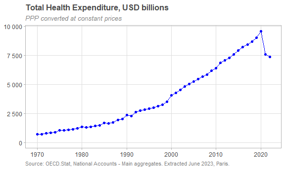
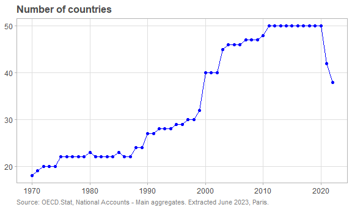

Hello World!
================
Claudia Tanaka
2024-02-18

<br>

## Health expenditure

Data downloaded from [OECD Data
Explorer](https://data-explorer.oecd.org/)

Read .csv and write to .parquet

``` r
# Health expenditure and financing
## DATAFLOW  OECD.ELS.HD:DSD_SHA@DF_SHA(1.0)
## df.health_exp <- read_csv("_datasets/OECD.ELS.HD,DSD_SHA@DF_SHA,1.0+all.csv",name_repair="universal")
#
# df.health_exp |>
#   group_by(TIME_PERIOD) |>
#   arrow::write_dataset("_datasets/OECD_HEALTH_EXP/")
```

<br>

Read from .parquet

``` r
oecd.hlth.exp <- open_dataset("_datasets/OECD_HEALTH_EXP/") |>
  select(-c(STRUCTURE, STRUCTURE_ID, STRUCTURE_NAME, ACTION,
            Measure, MEASURE, Currency, Decimals, DECIMALS,
            FINANCING_SCHEME_REV, Revenues.of.financing.schemes,
            FACTOR_PROVISION, Factor.of.provision, Observation.value, Base.period,
            Asset.type, ASSET_TYPE, PRICE_BASE,
            Time.period,
            OBS_STATUS, OBS_STATUS2, OBS_STATUS3, Observation.status.3,
            UNIT_MULT,
            FREQ, Frequency.of.observation)) |>
  rename(iso3c=REF_AREA, country=Reference.area, year=TIME_PERIOD,
         health_function=7) |>
  mutate(year = as.integer(year)) |>
  rename_with(tolower)
```

<br>

### Inspect

``` r
glimpse(oecd.hlth.exp)
```

    ## FileSystemDataset with 53 Parquet files (query)
    ## 10,332,221 rows x 20 columns
    ## $ iso3c                <string> "KOR", "KOR", "CAN", "AUT", "KOR", "AUS", "KOR",…
    ## $ country              <string> "Korea", "Korea", "Canada", "Austria", "Korea", …
    ## $ unit_measure         <string> "PT_B1GQ", "PT_EXP_HLTH", "PT_EXP_PRV", "XDC", "…
    ## $ unit.of.measure      <string> "Percentage of GDP", "Percentage of expenditure …
    ## $ financing_scheme     <string> "_T", "HF2", "HF1", "HF1", "_T", "HF2HF3", "HF31…
    ## $ financing.scheme     <string> "Total", "Voluntary health care payment schemes"…
    ## $ health_function      <string> "BASIC", "HC1HC2", "HC6HC7", "_T", "HC1_HC5", "H…
    ## $ health.function      <string> "Basic health care services", "Curative and reha…
    ## $ mode_provision       <string> "_T", "_T", "_T", "_T", "_T", "_T", "_T", "_T", …
    ## $ mode.of.provision    <string> "Total", "Total", "Total", "Total", "Total", "To…
    ## $ provider             <string> "HP6", "_T", "_T", "_T", "HP3", "_T", "_T", "_T"…
    ## $ health.care.provider <string> "Providers of preventive care", "Total", "Total"…
    ## $ price.base           <string> "Not applicable", "Not applicable", "Not applica…
    ## $ obs_value            <double> 0.036, 1.073, 100.000, 3877.534, 5.078, 57.488, …
    ## $ base_per             <double> NA, NA, NA, 2015, NA, NA, NA, NA, NA, 2015, 2015…
    ## $ currency             <string> NA, NA, NA, "EUR", NA, NA, NA, NA, NA, "KRW", NA…
    ## $ observation.status   <string> NA, NA, NA, NA, NA, NA, NA, NA, NA, NA, NA, NA, …
    ## $ observation.status.2 <string> NA, NA, NA, NA, NA, NA, NA, NA, NA, NA, NA, NA, …
    ## $ unit.multiplier      <string> "Units", "Units", "Units", "Millions", "Units", …
    ## $ year                  <int32> 1971, 1971, 1971, 1971, 1971, 1971, 1971, 1971, …
    ## Call `print()` for query details

<br>

``` r
colSums(is.na(collect(oecd.hlth.exp))) |> as.data.frame() |> rownames_to_column() |> 
  rename(coluna=1,nulos=2) |> 
  filter(nulos>0) |> arrange(desc(nulos))
```

    ##                 coluna    nulos
    ## 1 observation.status.2 10322288
    ## 2   observation.status  9559770
    ## 3             currency  7643392
    ## 4             base_per  6641670

``` r
unique(collect(oecd.hlth.exp)$price.base)
```

    ## [1] "Not applicable"  "Constant prices" "Current prices"

``` r
oecd.hlth.exp |> 
  summarise(n=n(), .by=c(unit_measure, unit.of.measure)) |> 
  arrange(unit_measure) |> 
  collect()
```

    ## # A tibble: 11 × 3
    ##    unit_measure unit.of.measure                                              n
    ##    <chr>        <chr>                                                    <int>
    ##  1 EUR_PPP      Euros, PPP converted                                   1007544
    ##  2 EUR_PPP_PS   Euros per person, PPP converted                        1002475
    ##  3 PT_B1GQ      Percentage of GDP                                       616611
    ##  4 PT_EXP_FNC   Percentage of expenditure in the same function          568606
    ##  5 PT_EXP_FS    Percentage of expenditure in the same financing scheme  561053
    ##  6 PT_EXP_HLTH  Percentage of expenditure on health                     634042
    ##  7 PT_EXP_PRV   Percentage of expenditure in the same provider          570319
    ##  8 USD_PPP      US dollars, PPP converted                              1344483
    ##  9 USD_PPP_PS   US dollars per person, PPP converted                   1338259
    ## 10 XDC          National currency                                      1347114
    ## 11 XDC_PS       National currency per person                           1341715

``` r
oecd.hlth.exp |> 
  summarise(n=n(), .by=c(financing_scheme, financing.scheme)) |> 
  arrange(financing_scheme) |> 
  collect()
```

    ## # A tibble: 16 × 3
    ##    financing_scheme financing.scheme                                         n
    ##    <chr>            <chr>                                                <int>
    ##  1 HF1              Government/compulsory schemes                       904236
    ##  2 HF11             Government schemes                                  707080
    ##  3 HF121            Social health insurance schemes                     433106
    ##  4 HF122            Compulsory private insurance schemes                117949
    ##  5 HF12HF13         Compulsory contributory health insurance schemes    559223
    ##  6 HF2              Voluntary health care payment schemes               571368
    ##  7 HF21             Voluntary health insurance schemes                  439794
    ##  8 HF22             NPISH financing schemes                             248628
    ##  9 HF23             Enterprise financing schemes                        171609
    ## 10 HF2HF3           Voluntary schemes/household out-of-pocket payments  764271
    ## 11 HF3              Household out-of-pocket payments                    606934
    ## 12 HF31             Out-of-pocket excluding cost-sharing                219342
    ## 13 HF32             Cost-sharing with third-party payers                165827
    ## 14 HF4              Rest of the world financing schemes (non-resident)   32154
    ## 15 _T               Total                                              4385749
    ## 16 _U               Unknown                                               4951

``` r
oecd.hlth.exp |> 
  summarise(n=n(), .by=c(health_function, health.function)) |> 
  arrange(health_function) |> 
  collect()
```

    ## # A tibble: 48 × 3
    ##    health_function health.function                                      n
    ##    <chr>           <chr>                                            <int>
    ##  1 BASIC           Basic health care services                      194064
    ##  2 BASIC_PH        Basic health care services and pharmaceuticals  157540
    ##  3 HC0             Other health care services unknown               56978
    ##  4 HC1             Curative care                                   871726
    ##  5 HC131           General curative care                           175062
    ##  6 HC132           Dental curative care                            164315
    ##  7 HC133           Specialised curative care                       146060
    ##  8 HC139           Other curative care                             105292
    ##  9 HC1HC2          Curative and rehabilitative care               1023803
    ## 10 HC1_HC4         Individual health care services                 361939
    ## # ℹ 38 more rows

``` r
oecd.hlth.exp |> 
  summarise(n=n(), .by=c(mode_provision, mode.of.provision)) |> 
  arrange(mode_provision) |> 
  collect()
```

    ## # A tibble: 5 × 3
    ##   mode_provision mode.of.provision       n
    ##   <chr>          <chr>               <int>
    ## 1 DAY            Day                363532
    ## 2 HB             Home-based         408654
    ## 3 HBEDT          Inpatient          667781
    ## 4 HBOUT          Outpatient        1266758
    ## 5 _T             Total             7625496

``` r
oecd.hlth.exp |> 
  summarise(n=n(), .by=c(provider, health.care.provider)) |> 
  arrange(provider) |> 
  collect()
```

    ## # A tibble: 34 × 3
    ##    provider health.care.provider                                            n
    ##    <chr>    <chr>                                                       <int>
    ##  1 HP1      Hospitals                                                  432118
    ##  2 HP11     General hospitals                                          353704
    ##  3 HP12     Mental health hospitals                                    207843
    ##  4 HP13     Specialised hospitals (other than mental health hospitals) 238416
    ##  5 HP2      Residential long-term care facilities                      231269
    ##  6 HP21     Long-term nursing care facilities                          161459
    ##  7 HP22     Mental health and substance abuse faciltites                78058
    ##  8 HP29     Other residential long-term care facilities                 82045
    ##  9 HP3      Providers of ambulatory health care                        454415
    ## 10 HP31     Medical practices                                          323918
    ## # ℹ 24 more rows

<br>

### Summarize

<!-- -->

<br>

<!-- -->

<br>

**Health Expenditure by Financing Scheme, 2022** *USD Millions PPP
converted at constant prices*

    ## # A tibble: 14 × 4
    ##    financing.scheme                                   countries health_usd   pct
    ##    <chr>                                                  <int>      <dbl> <dbl>
    ##  1 Government/compulsory schemes                             38  6003043.   64.7
    ##  2 Voluntary schemes/household out-of-pocket payments        38  1384586.   14.9
    ##  3 Government schemes                                        15   703797.    7.6
    ##  4 Household out-of-pocket payments                          19   318546.    3.4
    ##  5 Compulsory contributory health insurance schemes          11   281560.    3  
    ##  6 Social health insurance schemes                           11   226801.    2.4
    ##  7 Voluntary health care payment schemes                     18   109065.    1.2
    ##  8 Voluntary health insurance schemes                        13    71956.    0.8
    ##  9 Out-of-pocket excluding cost-sharing                       6    66049.    0.7
    ## 10 Compulsory private insurance schemes                       4    54759.    0.6
    ## 11 Cost-sharing with third-party payers                       4    35491.    0.4
    ## 12 NPISH financing schemes                                   13    11668.    0.1
    ## 13 Enterprise financing schemes                              10     5535.    0.1
    ## 14 Rest of the world financing schemes (non-resident)         2       43.6   0

*Source: OECD.Stat, National Accounts - Main aggregates. Extracted June
2023, Paris.*

<br>

Create a dataset with total health expenditure, percent of GDP and
health spend per capita per country and year.

Create a dataset with financing schemes detailed by country and year.

<br>

## Coverage

``` r
# DATAFLOW  OECD.ELS.HD:DSD_HEALTH_PROT@DF_HEALTH_PROT(1.0)
# Social protection
# HIC - Health insurance coverage
oecd.cvrg <- read_csv("_datasets/OECD.HI_coverage.csv", name_repair="universal") |>
  select(-c(STRUCTURE, STRUCTURE_ID, STRUCTURE_NAME, ACTION,
            FREQ, Frequency.of.observation,
            Measure, MEASURE, UNIT_MEASURE, Unit.of.measure,
            INSURANCE_TYPE,
            Time.period, Observation.value,
            OBS_STATUS,
            UNIT_MULT, Unit.multiplier,
            Decimals, DECIMALS)) |>
  rename(iso3c=REF_AREA, country=Reference.area, year=TIME_PERIOD) |>
  mutate(year = as.integer(year)) |>
  rename_with(tolower)
```

<br>

### Inspect

``` r
glimpse(oecd.cvrg)
```

    ## Rows: 6,410
    ## Columns: 6
    ## $ iso3c              <chr> "NLD", "NLD", "NLD", "NLD", "NLD", "NLD", "NLD", "N…
    ## $ country            <chr> "Netherlands", "Netherlands", "Netherlands", "Nethe…
    ## $ insurance.type     <chr> "Public and primary voluntary health insurance", "P…
    ## $ year               <int> 1960, 1961, 1962, 1963, 1964, 1965, 1966, 1967, 196…
    ## $ obs_value          <dbl> 71.0, 71.0, 71.0, 71.0, 71.0, 71.0, 69.9, 69.6, 69.…
    ## $ observation.status <chr> "Normal value", "Normal value", "Normal value", "No…

``` r
range(oecd.cvrg$year)
```

    ## [1] 1960 2022

``` r
oecd.cvrg |> summarise(n=n(), .by=c(insurance.type))
```

    ## # A tibble: 7 × 2
    ##   insurance.type                                    n
    ##   <chr>                                         <int>
    ## 1 Public and primary voluntary health insurance  1724
    ## 2 Total voluntary health insurance                693
    ## 3 Primary voluntary health insurance              637
    ## 4 Complementary voluntary health insurance        578
    ## 5 Supplementary voluntary health insurance        516
    ## 6 Government/compulsory health insurance         1724
    ## 7 Duplicate voluntary health insurance            538

<br>

### Summarize

**Mean health coverage 2022** *as percent of population*

    ## # A tibble: 7 × 3
    ##   insurance.type                                countries   pct
    ##   <chr>                                             <int> <dbl>
    ## 1 Public and primary voluntary health insurance        20 98.7 
    ## 2 Government/compulsory health insurance               20 97.9 
    ## 3 Total voluntary health insurance                     10 34   
    ## 4 Supplementary voluntary health insurance              7 31.4 
    ## 5 Complementary voluntary health insurance              7 30.2 
    ## 6 Duplicate voluntary health insurance                  4 24.6 
    ## 7 Primary voluntary health insurance                    7  2.27

*Source: OECD, OECD Health Statistics 2023. July 2023.*

<br>

Must add population data to get weighted average of coverage by
insurance type.
